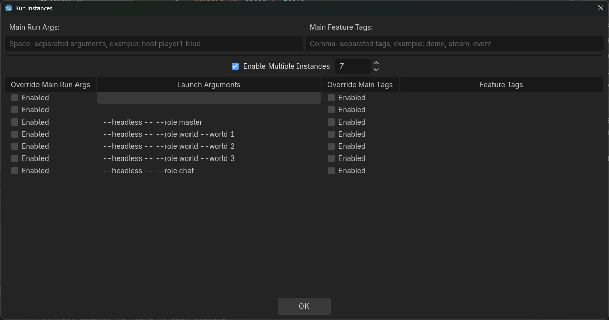

# Minimal Godot 4 Multi-Server Multiplayer Spike

Branch note: the `nakama` branch is a Nakama glue MVP. The client now uses the
vendored Nakama Godot SDK for guest auth, RPC, and room chat, while gameplay
still connects directly to Godot headless world servers. A tiny Go daemon owns
local world process orchestration. Start with
[`docs/nakama-mvp.md`](docs/nakama-mvp.md) for the current branch workflow.

This is a one-project Godot 4.6 MVP proving a native multiplayer topology with:

- One client.
- One master server.
- One chat server.
- Three world servers.
- WebSocket-based `MultiplayerAPI` peers.
- Separate client multiplayer contexts for master, chat, and active world.
- A persistent chat connection while the active world connection is replaced.
- Live world registration with the master server before client route lookup.
- A tiny top-down `CharacterBody2D` player.
- Three visibly distinct worlds with portal transfer topology:
  - World 1 -> World 2
  - World 2 -> World 1
  - World 1 -> World 3
  - World 3 -> World 1

This is intentionally a spike, not a production framework.

For a complete explanation of how the multi-server setup works and how to grow it into a small online world prototype, read the [Godot Multi-Server Architecture Guide](docs/godot-multi-server-architecture-guide.md).

## Structure

- `launcher/`: the one main scene. It reads `--role`.
- `client/`: client root, player, world scenes, and portals.
- `server/master/`: master route server.
- `server/chat/`: separate chat server.
- `server/world/`: shared world server role, configured by `--world`.
- `orchestrator/`: lightweight Go on-demand world process supervisor for the
  Nakama MVP branch.
- `nakama/`: Nakama Lua runtime/config files to mount into your Nakama server.
- `addons/com.heroiclabs.nakama/`: vendored Nakama Godot SDK.
- `shared/`: shared endpoints, config, and CLI parsing.
- `tools/`: export and smoke-test scripts.
- `docs/`: research and audit notes.
- `run_instance_grid.gd`: editor autoload that tiles visible Run Instances windows and helps manual multi-client debugging.

Main documentation:

- [Godot Multi-Server Architecture Guide](docs/godot-multi-server-architecture-guide.md): canonical high-level and detailed walkthrough of the current working architecture.
- [VirtuCade Infrastructure](docs/virtucade.md): proposed future infrastructure for a small-scale production VirtuCade using Gateway, Master, World, and Social as conceptual roles that can be compressed into fewer services.
- [VirtuCade Custom Godot, SQLite, And PocketBase Decision](docs/virtucade-custom-godot-sqlite-pocketbase-decision.md): latest decision spike recommending a custom Godot Master plus embedded SQLite as the next production-shaped path, with PocketBase as an optional fallback.
- [VirtuCade Infrastructure Options, PocketBase, And Nakama Research](docs/virtucade-infrastructure-options.md): decision research comparing a full custom split, a Go/PocketBase Master Backend, and Nakama plus Godot dedicated world servers.
- [Nakama And Godot World Server Viability Research](docs/nakama-godot-world-server-viability.md): deep Nakama-specific research for using Nakama as the backend/control/social/database platform while Godot headless servers own gameplay worlds.
- [Nakama MVP Glue](docs/nakama-mvp.md): current branch implementation notes and
  local run instructions for Nakama plus the Go orchestrator and Godot world
  servers.
- [Lightweight Orchestration Spike](docs/orchestration-language-spike.md):
  language/runtime comparison and recommendation for a Go orchestrator under
  systemd on Linux.
- [Godot Tiny MMO Comparison Research](docs/godot-tiny-mmo-comparison.md): comparison against SlayHorizon's Godot Tiny MMO project, including what to borrow later and what should stay out of the minimal production loop.
- [Godot Tiny MMO Database Research](docs/godot-tiny-mmo-database-resource-vs-sqlite-research.md): focused research on Tiny MMO's Resource-vs-SQLite persistence history, old 2D MMO file storage, and a test plan for mini-MMORPG persistence tradeoffs.
- [JDungeon Comparison Research](docs/jdungeon-comparison.md): comparison against JDungeon's Godot MORPG source, including gateway routing, component sync, persistence, and deployment tradeoffs.
- [Godot 4 Network Tutorial Comparison Research](docs/godot4-network-tutorial-comparison.md): comparison against Something Like Games' Godot 4 networking tutorial, including JWT handoff, ENet/DTLS caveats, and high-level scene replication patterns.
- [Intersect Engine Research](docs/intersect-engine-research.md): research on AscensionGameDev's mature C# / MonoGame 2D MMORPG engine, including server authority, databases, packet networking, maps, and lessons for this Godot spike.
- [Godot Multiplayer Project Comparison Matrix](docs/godot-multiplayer-project-comparison.md): table comparison across this project, Godot Tiny MMO, JDungeon, and Godot 4 Network Tutorial.
- [End-to-End Validation Findings](docs/end-to-end-validation.md): final smoke-test and export validation notes.
- [Server Orchestration And Server Travel Research](docs/server-orchestration-and-travel.md): research notes that led to live world registration and branch-local travel.

The client uses sibling networking branches:

- `MasterNet/MasterEndpoint`
- `ChatNet/ChatEndpoint`
- `WorldNet/WorldEndpoint`

Those names are mirrored in the server scenes so RPC paths and scripts match.

World servers also use a separate `MasterNet/MasterEndpoint` branch to register with master while their `WorldNet/WorldEndpoint` branch accepts gameplay clients.

World scene inheritance:

- `client/world/world.tscn` is the shared base world scene.
- `client/world/world_1.tscn`, `world_2.tscn`, and `world_3.tscn` inherit from it and only override identity, color, and portal targets.
- Client and world server both mount the active inherited world scene at `WorldNet/WorldSceneRoot`, so branch-local multiplayer paths match below `WorldNet`.
- `world.tscn` includes `SpawnRoot` plus a `MultiplayerSpawner` whose `spawn_path` points at that root.
- World servers spawn `Player_<peer_id>` instances as children of `SpawnRoot` when peers connect.
- `Player.tscn` includes a `MultiplayerSynchronizer` for `position`. The automated smoke test validates registration, chat, and travel, and it exercises spawning indirectly through world connections. It does not assert replicated player nodes or live movement synchronization; manual two-client testing is the better way to verify that.

## Run Roles From The Editor Binary

Use the local Godot 4.6.3 binary:

```powershell
$godot = "C:\Programming_Files\Godot\Godot_v4.6.3-stable_win64.exe\Godot_v4.6.3-stable_win64.exe"
```

Launch servers in separate terminals, or start them as background processes. These server commands keep running after they print their `*_READY` marker:

```powershell
& $godot --headless --path . -- --role master
& $godot --headless --path . -- --role chat
& $godot --headless --path . -- --role world --world 1
& $godot --headless --path . -- --role world --world 2
& $godot --headless --path . -- --role world --world 3
```

Launch a manual client:

```powershell
& $godot --path . -- --role client
```

Manual client mode is relaxed. It requires master plus the initial registered world, but chat and other worlds are optional. If only World 1 is registered, the client enters World 1 and hides portals to unavailable worlds.

Manual portal reproduction test with only master, World 1, and World 2:

```powershell
Start-Process -FilePath $godot -ArgumentList @("--headless", "--path", (Resolve-Path .), "--", "--role", "master")
Start-Process -FilePath $godot -ArgumentList @("--headless", "--path", (Resolve-Path .), "--", "--role", "world", "--world", "1")
Start-Process -FilePath $godot -ArgumentList @("--headless", "--path", (Resolve-Path .), "--", "--role", "world", "--world", "2")
& $godot --headless --path . -- --role client --manual-portal-test
```

Success logs include `MANUAL_PORTAL_TEST_PASS`.

## Test From Godot Run Instances

Use Godot's editor launcher when you want visible local clients and headless local servers.

Open:

```text
Debug > Customize Run Instances...
```



Recommended setup for two visible clients plus the full server topology:

- Leave `Main Run Args` empty. The main run becomes one visible client.
- Enable `Enable Multiple Instances`.
- Set the instance count to `7`.
- Leave the first extra instance's `Launch Arguments` empty. This becomes the second visible client.
- Add these launch arguments for the remaining extra instances:

```text
--headless -- --role master
--headless -- --role world --world 1
--headless -- --role world --world 2
--headless -- --role world --world 3
--headless -- --role chat
```

The final run-instance table should conceptually be:

```text
main editor run: visible client
instance 1:       visible client
instance 2:       --headless -- --role master
instance 3:       --headless -- --role world --world 1
instance 4:       --headless -- --role world --world 2
instance 5:       --headless -- --role world --world 3
instance 6:       --headless -- --role chat
```

Then press Play. Expected behavior:

- Both visible clients connect to master, chat, and World 1.
- Both clients spawn `Player_<peer_id>` nodes under `SpawnRoot`.
- Chat messages sent with Enter show the sender peer id.
- A local-authority player entering a portal transfers only that client.
- Chat remains connected while the active world connection changes.

Important testing notes:

- Stop the previous run before starting another one. Otherwise old headless servers can keep ports `19080` through `19084` bound.
- The client performs a single connection wait, not a retry loop. Make sure master and the initial world are listening before clients start; if a client fetches routes before every world registers, manual mode only sees worlds registered in that startup snapshot.
- If you change scripts or scenes used by the headless roles, stop and restart the run instances so those server processes reload the project.
- Run-instance testing is for manual visual verification. Use `tools/run_smoke.ps1` for repeatable pass/fail automation.

## Automated Smoke Test

On the `nakama` branch, use the Nakama smoke runner after your Nakama server is
already running:

```powershell
powershell -ExecutionPolicy Bypass -File tools\run_nakama_smoke.ps1
```

The older `tools/run_smoke.ps1` flow is retained for the pre-Nakama
master/chat/world topology on the mainline implementation, but the current
branch client defaults to Nakama guest auth and Nakama chat.

Editor/headless smoke:

```powershell
powershell -ExecutionPolicy Bypass -File tools\run_smoke.ps1
```

Two simultaneous editor/headless clients:

```powershell
powershell -ExecutionPolicy Bypass -File tools\run_smoke.ps1 -ClientCount 2
```

Exported-artifact smoke:

```powershell
powershell -ExecutionPolicy Bypass -File tools\run_smoke.ps1 -UseExported
```

Three simultaneous exported clients:

```powershell
powershell -ExecutionPolicy Bypass -File tools\run_smoke.ps1 -UseExported -ClientCount 3
```

Successful logs include:

- `MASTER_READY`
- `CHAT_READY`
- `WORLD_READY id=1`
- `WORLD_READY id=2`
- `WORLD_READY id=3`
- `MASTER_WORLD_REGISTERED id=1`
- `MASTER_WORLD_REGISTERED id=2`
- `MASTER_WORLD_REGISTERED id=3`
- `SMOKE_STEP client connected to chat`
- `SMOKE_STEP client confirmed initial world 1`
- `SMOKE_STEP confirmed world 2 with chat alive`
- `SMOKE_STEP confirmed world 1 with chat alive`
- `SMOKE_STEP confirmed world 3 with chat alive`
- `SMOKE_STEP confirmed world 1 with chat alive`
- `SMOKE_PASS`

Logs are written under `.logs/` and ignored by git.

## Export

Install Godot export templates for `4.6.3.stable` first if needed. The export script expects Windows Desktop templates at Godot's normal template path.

Export all role-labeled artifacts:

```powershell
powershell -ExecutionPolicy Bypass -File tools\export_all.ps1
```

Outputs:

- `builds/client/client.exe`
- `builds/client/client.pck`
- `builds/master/master.exe`
- `builds/master/master.pck`
- `builds/chat/chat.exe`
- `builds/chat/chat.pck`
- `builds/world1/world1.exe`
- `builds/world1/world1.pck`
- `builds/world2/world2.exe`
- `builds/world2/world2.pck`
- `builds/world3/world3.exe`
- `builds/world3/world3.pck`

Each role output is an `.exe` plus a sibling `.pck`, because the export preset does not embed the pack file. Keep each pair together when running or moving builds. The script exports one shared debug artifact under `builds/_shared/` and copies it into role-labeled folders; role behavior still comes from `--role` and `--world`, which keeps the MVP simple and proves shared-project export without multiplying projects.

## Research Findings

Research notes:

- `docs/spike-findings.md`
- `docs/research-sweep.md`
- `docs/server-orchestration-and-travel.md`
- `docs/end-to-end-validation.md`

Important Godot limitations discovered:

- Custom multiplayer branches cannot be nested.
- RPC paths, node names, RPC annotations, and script signatures must match.
- Client-to-server RPCs need `@rpc("any_peer")`.
- Branch-local multiplayer works for separate contexts, but connection status checking was more reliable than relying only on `connected_to_server` signals in this smoke.
- `MultiplayerSpawner` and `MultiplayerSynchronizer` are present in the current scenes. Server travel should still fully tear down and rebuild the active replicated world branch. Do not carry live synchronized nodes from one server peer to another.
- Godot 4 dedicated server execution uses `--headless`; no separate Godot 3-style server binary is needed.

Runtime/testing split:

- Manual client mode: relaxed partial topology for debugging.
- `--smoke-test`: strict full topology, requiring chat and worlds 1/2/3.

MCP and local validation used:

- Godot MCP `get_project_info`.
- Godot CLI parse checks.
- Godot CLI headless role launches.
- Multi-process editor/headless smoke.
- Exported-artifact smoke.

## Next Mimic-Oriented Steps

- Turn `MasterNet`, `ChatNet`, and `WorldNet` into explicit reusable context nodes.
- Create editor-visible configuration for endpoints and allowed transfers.
- Keep RPC endpoint names stable or generate mirrored client/server scenes.
- Add a tiny test harness around branch setup timing and RPC path validation.
- Resist adding replication/prediction until the branch-context abstraction is proven.
