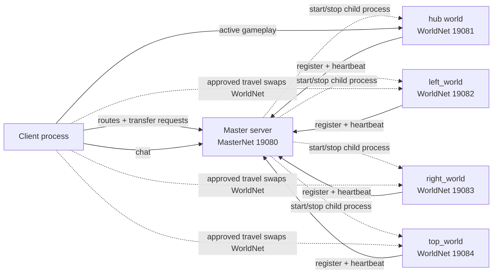

# Godot Three-Role Multi-Server Architecture Guide

This document explains the current Godot setup after the three-role refactor. The project is still intentionally small, but it now models the workflow we want to keep exploring for a small-scale online world:

- `client`: visible game client.
- `master`: control-plane server plus chat host.
- `world`: temporary gameplay server process, one instance per active world key.
- master-owned orchestration starts worlds on demand and stops them after they are empty.
- world registration uses per-launch tokens generated by master.
- host and ports are fixed in `shared/net/net_config.gd`.

There is no gateway process, standalone chat process, auth server, database, persistence layer, Docker layer, or external fleet service in this refactor.

For the broader VirtuCade direction, see [VirtuCade Experience Architecture Research](virtucade-experience-architecture-research.md). That spike treats the current shape as a Roblox-like `experience/place` model: the master is the durable control plane, and each world process is a temporary mini-game/experience runtime.

## Runtime Shape

Normal editor/export startup uses the main scene:

```text
res://shared/main/main.tscn
```

`shared/main/main.gd` selects a role from export feature tags plus user args:

- `server` or `dedicated_server` with no user args starts `res://server/master/master.tscn`
- `server` or `dedicated_server` with a world key after `--` starts `res://server/world/world.tscn`
- no server feature tag starts `res://client/client.tscn`

Editor-binary smoke tests and CI launch the master and client scenes directly with Godot's built-in `--scene`, because Godot CLI does not provide a clean way to inject custom feature tags at launch time. The master launches world scenes itself. Exported smoke runs the client artifact plus one standalone server artifact. The exported master launches worlds by creating additional instances of that same server executable.

## Topology



The key Godot technique is separate sibling multiplayer branches. The client has one `MultiplayerAPI` per branch:

```text
ClientRoot
  MasterNet
    MasterEndpoint
    ChatEndpoint
  WorldNet
    WorldEndpoint
    WorldSceneRoot
  CanvasLayer
    StatusLabel
```

The master server mirrors the master branch:

```text
MasterServer
  MasterNet
    MasterEndpoint
    ChatEndpoint
```

The world server has one branch for gameplay clients and one branch for registering with master:

```text
WorldServer
  WorldNet
    WorldEndpoint
    WorldSceneRoot
  MasterNet
    MasterEndpoint
```

Chat is logically separate code, but it shares the master socket. The active gameplay world still uses its own socket.

## Directory Map

```text
shared/
  main/
    main.tscn
    main.gd
  net/
    net_config.gd
    master_endpoint.gd
    chat_endpoint.gd
    world_endpoint.gd
  player/
    player.tscn
    player.gd
  world/
    world.tscn
    world.gd
    portal.tscn
    portal.gd
    spawn.gd
  worlds/
    hub/
      hub.tscn
    left_world/
      left_world.tscn
    right_world/
      right_world.tscn
    top_world/
      top_world.tscn

client/
  client.tscn
  client.gd
  chat/
    chat.tscn
    chat.gd

server/
  master/
    master.tscn
    master.gd
    world_process_manager.gd
  world/
    world.tscn
    world.gd
```

`shared/` is intentionally named `shared`, not `common`, because it describes shared project code across client, master, and world roles. Role-only code stays in the role folders.

## Network Config

`shared/net/net_config.gd` discovers playable worlds from `shared/worlds/`.

Current ports:

```text
master:      19080
hub:         19081
left_world: 19082
right_world: 19083
top_world:  19084
```

Current world keys:

```text
hub
left_world
right_world
top_world
```

Derived rules:

- `hub` is the default world.
- A playable world must live at `res://shared/worlds/<world_key>/<world_key>.tscn`.
- World keys are sorted after discovery.
- World ports are derived from `MASTER_PORT + 1 + sorted_world_index`, so with the current `MASTER_PORT` of `19080`, world ports start at `19081`.
- Display names are derived from the world key.
- Portal topology lives in the world scenes, not in `NetConfig`.
- World registration tokens are not in `NetConfig`; the master generates a fresh token for each launched child process.

Port allocation note:

- The current MVP does not use a port pool. Ports are deterministic per discovered world key, not incremented per launch.
- Starting and stopping the same world repeatedly reuses that world's deterministic port after the OS releases it.
- This is fine for hundreds of distinct world scenes on one VPS; for example 500 worlds would use `19081` through `19580`.
- The limitation is one active server process per world key. If VirtuCade later needs multiple simultaneous instances of the same world/experience, replace deterministic keyed ports with a master-owned reusable port pool.
- A port pool would allocate a free port when a world instance starts, return it when that process stops, and advertise the assigned port through the existing master route response.

Important helpers:

- `world_keys()`
- `world_endpoint(world_key)`
- `world_scene_path(world_key)`
- `initial_world()`

## Future State Ownership

The current spike has no database. When persistence is added, the intended ownership split is:

```text
global_profile      master-owned durable state
world_session       world-owned ephemeral process state
world_player_state  master-owned durable per-world save data
world_result        idempotent world-to-master reward/result event
```

World servers should not directly write global player, inventory, currency, or account data. They should report save/load requests or final results to the master, which becomes the single SQLite writer for durable state.

## World Startup Arguments

The world role accepts a bare positional world key after Godot's `--`. Master-owned launches append one private launch token after the key.

```powershell
& $godot --headless --path . --scene res://server/world/world.tscn -- hub
& $godot --headless --path . --scene res://server/world/world.tscn -- left_world
& $godot --headless --path . --scene res://server/world/world.tscn -- right_world
& $godot --headless --path . --scene res://server/world/world.tscn -- top_world
```

Direct launches without a launch token are useful for isolated world-scene debugging, but they do not register with master. The world key is explicit and required. If no user argument is provided or the key is invalid, startup fails.

## Master Responsibilities

The master process owns:

- World process orchestration.
- World registry.
- Route snapshots.
- Transfer approval.
- Chat.

Startup behavior:

1. Creates a `MultiplayerAPI` for `MasterNet`.
2. Starts a `WebSocketMultiplayerPeer` server on port `19080` using Godot's default bind address.
3. Hosts `MasterEndpoint` and `ChatEndpoint` under the same branch.
4. Configures `WorldProcessManager`.
5. Prints `MASTER_READY`.

World orchestration behavior:

1. A route or transfer request calls `ensure_world_started(world_key)`.
2. Master launches the world server with `OS.create_instance()`.
3. Editor/smoke launches create another instance of the current Godot executable plus `--path`, `--scene`, `--`, world key, and launch token.
4. Exported launches create another instance of the same standalone server executable plus `--`, world key, and launch token.
5. Child worlds inherit the master's display mode: visible masters spawn visible worlds, and headless masters spawn headless worlds.
6. Master records the PID, launch token, state, player count, idle timestamp, and pending join reservations.
7. When master sends a route or transfer approval, it records a pending-join reservation for that peer and world.
8. Master issues a short-lived one-use join ticket and sends it to both the client and the target world.
9. While the client is connecting to the approved world, it refreshes that reservation over `MasterNet`.
10. A world is eligible for idle shutdown only when it has `0` connected gameplay peers and `0` pending join reservations.
11. Pending join reservations are released when the client completes or cancels the join, and expire automatically if the client stops refreshing.
12. If a launched world does not register before the start timeout, master requests shutdown and then kills the recorded PID if needed.
13. If the world does not exit after the stop grace window, master kills the recorded PID.

World registration behavior:

1. A world connects to `MasterNet`.
2. The world calls `register_world(world_key, launch_token)`.
3. Master validates the key and launch token against a child process it started.
4. Master computes and stores the live endpoint by world key.
5. Master prints `MASTER_WORLD_REGISTERED key=<world_key>`.
6. Master acknowledges the world.
7. The world treats itself as registered only after that acknowledgement. If registration is rejected or not acknowledged, the world exits.

Transfer approval behavior:

1. Client keeps `MasterNet` connected.
2. A scene-authored `Portal` emits its portal name and local target label.
3. Client asks the current world server to use that portal by portal name.
4. The world server validates the player is near that portal on the server's replicated state.
5. The world server resolves `target_world` and optional `target_portal` from the scene-authored `Portal`.
6. The world server asks master for transfer approval.
7. Master starts the target world if it is not already running.
8. Master waits briefly for registration.
9. Master reserves a pending join for the requesting peer.
10. Master sends a one-use join ticket to the target world and includes it in the approved endpoint data.
11. Master sends either approval with endpoint data or a denial.
12. Client swaps only `WorldNet` after approval and presents the join ticket before requesting world state.

The pending join reservation is the race guard between transfer approval and idle shutdown. It prevents an empty world from shutting down while the approved client is still opening its world connection. The client refreshes the reservation over the persistent master connection while it connects to the target world, then releases it after receiving world state or after a failed join. If the client disappears, master releases that peer's reservations on disconnect; if the client stalls without refreshing, the reservation expires and the normal empty-world idle timer starts again. If a target world is already in the `stopping` state, master waits briefly for it to finish stopping and then starts a replacement before approving the transfer.

## Chat Responsibilities

Chat is still logically separate from gameplay and route control, but it is no longer a standalone process or socket.

The chat endpoint lives at:

```text
MasterServer/MasterNet/ChatEndpoint
ClientRoot/MasterNet/ChatEndpoint
```

Chat flow:

1. Client connects `MasterNet`.
2. User presses Enter in the chat panel.
3. Client calls `send_chat.rpc_id(1, message)`.
4. Master reads the sender peer id.
5. Master applies length and rate caps.
6. Master broadcasts `receive_chat(sender_id, message)`.

World travel replaces only the `WorldNet` peer. `MasterNet` stays connected through transfers, so chat remains available.

### Why Chat Shares MasterNet

A separate chat WebSocket can reduce head-of-line blocking between chat and master control messages, because each WebSocket is its own reliable TCP stream. That protection is only useful if chat can become large or bursty enough to delay route and transfer messages.

For this project, gameplay traffic is already isolated on the active world socket. Master traffic is slow and durable, and chat now has message-size and rate caps. A second chat socket adds another port, another client connection, another `MultiplayerAPI`, another export/deploy surface, and more local smoke complexity while protecting only low-frequency control messages.

The current recommendation is therefore:

- Keep gameplay on its own world socket.
- Keep route, transfer, registry, heartbeat, and chat on one master socket.
- Reconsider a separate chat socket only after measured chat volume causes transfer or route latency.
- Do not move transfer/routing to HTTP yet; that would add a second protocol layer without solving a measured problem.

## World Responsibilities

Each world server process owns gameplay for exactly one world key. World servers are temporary; the master is the only process expected to stay online all the time.

Startup behavior:

1. Reads one or two user arguments.
2. Requires an explicit world key.
3. Stores the optional master launch token.
4. Loads the keyed world scene into `WorldNet/WorldSceneRoot`.
5. Starts a `WorldNet` WebSocket server on the keyed port.
6. Prints `WORLD_READY key=<world_key>`.
7. If a launch token exists, connects to master on `MasterNet`.
8. Registers the world key with the launch token.
9. Prints `WORLD_REGISTERED key=<world_key>` after master acknowledges registration.

World servers still own:

- Gameplay peer connections.
- Player spawn/despawn.
- Movement replication.
- World state replies.
- Player-count heartbeats.
- Shutdown on master request.
- Self-exit if an orchestrated world loses master for the cleanup window.
- Self-exit if master never acknowledges registration.

They do not own transfer approval. That belongs to master.

Worlds send heartbeats with player counts to master. Master stores heartbeat timestamps and expires stale world registrations if updates stop.

## World Scenes

`shared/world/world.tscn` is the base world scene.

```text
World
  SpawnRoot
  MultiplayerSpawner
```

The inherited scenes are:

- `shared/worlds/hub/hub.tscn`
- `shared/worlds/left_world/left_world.tscn`
- `shared/worlds/right_world/right_world.tscn`
- `shared/worlds/top_world/top_world.tscn`

They override:

- `world_key`
- `world_name`
- `world_color`
- `portal_targets_csv`

Client and world server both mount the active scene at:

```text
WorldNet/WorldSceneRoot
```

That matching path is required for high-level multiplayer spawning and synchronization.

## Player Spawning And Movement

`shared/player/player.tscn` is a `CharacterBody2D` with a `MultiplayerSynchronizer` for position.

Authority model:

- World server spawns `Player_<peer_id>` under `SpawnRoot`.
- Spawn data includes `peer_id` and starting position.
- The spawned player node gives multiplayer authority to that peer.
- The local authority player reads input and moves.
- Remote players do not consume local input.
- Position is synchronized through the `MultiplayerSynchronizer`.

This keeps the current MVP simple: movement is client-authority, while world servers still own spawn/despawn.

## Portal Travel

Portal flow:

1. Local authority player enters a portal.
2. `portal.gd` emits `portal_used(portal_name, target_world)`.
3. `world.gd` emits `portal_requested(portal_name, target_world)`.
4. `client.gd` sends the portal name to the current world server.
5. The world server validates the portal request and asks master to approve the resolved target world.
6. Master starts the target world if needed and waits for registration.
7. On approval, client disconnects the old world peer.
8. Client unloads the old world scene.
9. Client loads the target world scene.
10. Client connects `WorldNet` to the target world endpoint.
11. Client requests world state.
12. Master/chat remains connected.

Only local authority player bodies can activate portals, so remote synchronized bodies should not trigger travel for another client.

## Smoke And CI

The smoke script launches direct master/client scenes when using the editor binary:

```powershell
powershell -ExecutionPolicy Bypass -File tools\run_smoke.ps1
```

The smoke script discovers strict world folders for expectations, but does not launch worlds itself. With the current test worlds, the direct launches are:

```text
res://server/master/master.tscn
res://client/client.tscn -- smoke_test
```

With `-UseExported`, the smoke script runs `builds/client/client.exe` and `builds/server/server.exe` directly. The exported master launches additional instances of `builds/server/server.exe` on demand.

Expected markers:

```text
MASTER_READY
MASTER_WORLD_STARTED key=hub
MASTER_WORLD_REGISTERED key=hub
MASTER_WORLD_STOP_REQUESTED key=hub reason=idle
MASTER_WORLD_STOPPED key=hub
MASTER_WORLD_STARTED key=left_world
MASTER_WORLD_REGISTERED key=left_world
MASTER_WORLD_STOP_REQUESTED key=left_world reason=idle
MASTER_WORLD_STOPPED key=left_world
MASTER_WORLD_STARTED key=right_world
MASTER_WORLD_REGISTERED key=right_world
MASTER_WORLD_STOP_REQUESTED key=right_world reason=idle
MASTER_WORLD_STOPPED key=right_world
MASTER_WORLD_STARTED key=top_world
MASTER_WORLD_REGISTERED key=top_world
MASTER_WORLD_STOP_REQUESTED key=top_world reason=idle
MASTER_WORLD_STOPPED key=top_world
SMOKE_PROCESS_GONE hub_after_master_kill
SMOKE_PASS
```

The smoke sequence validates route lookup, on-demand world startup, chat round-trips, transfers from `hub` through every discovered non-hub world, world branch reconnection, idle world shutdown, and cleanup when the master process is killed. Manual two-client testing is still the better way to inspect live movement replication visually.

## Exporting

`tools/export_all.ps1` outputs a client artifact and one standalone server artifact:

```text
builds/client/client.exe
builds/server/server.exe
```

The client has a sibling `.pck`. The server export embeds its PCK so the server is a single executable containing the master role, world role, and all discovered world scenes.

The export presets are:

- `Windows Client`: no role feature tag.
- `Windows Server`: dedicated server export with the `server` feature tag.

### Single Server Export Rationale

The standalone server export intentionally contains both server roles and all world scenes. That increases package contents, but it does not make inactive roles or worlds run.

Godot scenes are resources. They are loaded through `load()`/`ResourceLoader.load()` or `preload()`, then instantiated as nodes. Godot's resource docs describe resources as data containers and note that loaded resources are cached and reference-counted; the `ResourceLoader` docs describe loading a resource from the filesystem into memory on demand. In this project, master preloads only small scripts/config and does not load or instantiate world scenes. A world process loads exactly one keyed world scene after startup.

The expected runtime cost difference between separate master/world server exports and one server export is therefore startup/package scanning and disk size, not steady-state gameplay CPU. Steady-state RAM should be governed by the scene actually loaded in that process, plus the shared Godot runtime and small always-loaded scripts. Dedicated-server export mode can still strip visuals later if package size becomes expensive.

References:

- [Godot dedicated server export docs](https://docs.godotengine.org/en/stable/tutorials/export/exporting_for_dedicated_servers.html)
- [Godot Resource docs](https://docs.godotengine.org/en/4.4/classes/class_resource.html)
- [Godot ResourceLoader docs](https://docs.godotengine.org/en/4.4/classes/class_resourceloader.html)

## Network Constants

`shared/net/net_config.gd` owns the advertised URL host. Playable worlds are discovered from strict `shared/worlds/<world_key>/<world_key>.tscn` folders; ports and display names are derived from sorted world keys. Servers use Godot's default `create_server(port)` bind behavior, while clients and world servers dial URLs built from `HOST`.

## Known Limits

- No login.
- No database.
- No persistence.
- No authenticated transfer/session tickets.
- No external supervisor/systemd unit yet.
- No reconnect UX.
- No server-side movement validation.
- No world population balancing.

Current guardrails are still deliberately small: master-owned child launch, per-launch world registration tokens, ACK-gated registration, short-lived world join tickets, start-timeout reaping, heartbeat expiry, player-count plus pending-join idle shutdown, target-world startup checks for transfer approval, and chat length/rate caps. The launch token is still passed as a process argument, which is fine for local validation but should be replaced before shared-host deployment. Before public testing, add authenticated sessions, server-side portal/travel authority, remote host configuration, persistence, and systemd/service hardening around the master.
