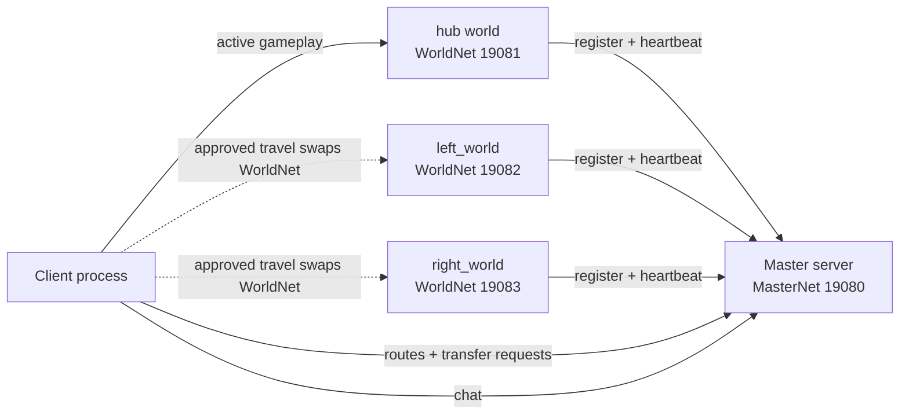

# Godot Three-Role Multi-Server Architecture Guide

This document explains the current Godot setup after the three-role refactor. The project is still intentionally small, but it now models the workflow we want to keep exploring for a small-scale online world:

- `client`: visible game client.
- `master_server`: control-plane server plus chat host.
- `world_server`: gameplay server process, one instance per world key.
- world registration uses a shared secret.
- host and ports are fixed in `shared/net/net_config.gd`.

There is no gateway process, standalone chat process, auth server, database, persistence layer, or orchestration layer in this refactor.

## Runtime Shape

Normal editor/export startup uses the main scene:

```text
res://shared/main/main.tscn
```

`shared/main/main.gd` selects a role from Godot feature tags:

- `master_server` starts `res://master_server/master_server.tscn`
- `world_server` starts `res://world_server/world_server.tscn`
- no role feature tag starts `res://client/client.tscn`

If both `master_server` and `world_server` are present, startup fails clearly.

Editor-binary smoke tests and CI launch scenes directly with Godot's built-in `--scene`, because Godot CLI does not provide a clean way to inject custom feature tags at launch time. Exported smoke runs the role-tagged artifacts directly, because exported Godot binaries do not support scene path overrides.

## Topology



The key Godot technique is separate sibling multiplayer branches. The client has one `MultiplayerAPI` per branch:

```text
ClientRoot
  MasterNet
    MasterEndpoint
    ChatEndpoint
  WorldNet
    WorldEndpoint
    WorldSceneRoot
  CanvasLayer
    StatusLabel
```

The master server mirrors the master branch:

```text
MasterServer
  MasterNet
    MasterEndpoint
    ChatEndpoint
```

The world server has one branch for gameplay clients and one branch for registering with master:

```text
WorldServer
  WorldNet
    WorldEndpoint
    WorldSceneRoot
  MasterNet
    MasterEndpoint
```

Chat is logically separate code, but it shares the master socket. The active gameplay world still uses its own socket.

## Directory Map

```text
shared/
  main/
    main.tscn
    main.gd
  net/
    net_config.gd
    master_endpoint.gd
    chat_endpoint.gd
    world_endpoint.gd
  player/
    player.tscn
    player.gd
  world/
    world.tscn
    world.gd
    portal_area.gd
  worlds/
    hub/
      hub.tscn
    left_world/
      left_world.tscn
    right_world/
      right_world.tscn

client/
  client.tscn
  client.gd
  chat/
    chat.tscn
    chat.gd

master_server/
  master_server.tscn
  master_server.gd

world_server/
  world_server.tscn
  world_server.gd
```

`shared/` is intentionally named `shared`, not `common`, because it describes shared project code across client, master, and world roles. Role-only code stays in the role folders.

## Network Config

`shared/net/net_config.gd` discovers playable worlds from `shared/worlds/`.

Current ports:

```text
master:      19080
hub:         19081
left_world: 19082
right_world: 19083
```

Current world keys:

```text
hub
left_world
right_world
```

Derived rules:

- `hub` is the default world.
- A playable world must live at `res://shared/worlds/<world_key>/<world_key>.tscn`.
- World keys are sorted after discovery.
- World ports start at `19081` and follow the sorted world key order.
- Display names are derived from the world key.
- Portal topology lives in the world scenes, not in `NetConfig`.

Important helpers:

- `world_keys()`
- `world_endpoint(world_key)`
- `world_scene_path(world_key)`
- `initial_world()`

## World Startup Arguments

The world role accepts exactly one world-selection syntax: a bare positional key after Godot's `--`.

```powershell
& $godot --headless --path . --scene res://world_server/world_server.tscn -- hub
& $godot --headless --path . --scene res://world_server/world_server.tscn -- left_world
& $godot --headless --path . --scene res://world_server/world_server.tscn -- right_world
```

If no user argument is provided, the world server starts `hub`. If more than one user argument is provided, or if the key is invalid, startup fails.

## Master Responsibilities

The master process owns:

- World registry.
- Route snapshots.
- Transfer approval.
- Chat.

Startup behavior:

1. Creates a `MultiplayerAPI` for `MasterNet`.
2. Starts a `WebSocketMultiplayerPeer` server on port `19080` using Godot's default bind address.
3. Hosts `MasterEndpoint` and `ChatEndpoint` under the same branch.
4. Prints `MASTER_READY`.

World registration behavior:

1. A world connects to `MasterNet`.
2. The world calls `register_world(world_key, registration_secret)`.
3. Master validates the key and registration secret against `NetConfig`.
4. Master computes and stores the live endpoint by world key.
5. Master prints `MASTER_WORLD_REGISTERED key=<world_key>`.
6. Master acknowledges the world.

Transfer approval behavior:

1. Client keeps `MasterNet` connected.
2. A portal emits a target world key.
3. Client asks master for transfer approval.
4. Master checks that the target world is registered.
5. Master sends either approval with endpoint data or a denial.
6. Client swaps only `WorldNet` after approval.

## Chat Responsibilities

Chat is still logically separate from gameplay and route control, but it is no longer a standalone process or socket.

The chat endpoint lives at:

```text
MasterServer/MasterNet/ChatEndpoint
ClientRoot/MasterNet/ChatEndpoint
```

Chat flow:

1. Client connects `MasterNet`.
2. User presses Enter in the chat panel.
3. Client calls `send_chat.rpc_id(1, message)`.
4. Master reads the sender peer id.
5. Master applies length and rate caps.
6. Master broadcasts `receive_chat(sender_id, message)`.

World travel replaces only the `WorldNet` peer. `MasterNet` stays connected through transfers, so chat remains available.

### Why Chat Shares MasterNet

A separate chat WebSocket can reduce head-of-line blocking between chat and master control messages, because each WebSocket is its own reliable TCP stream. That protection is only useful if chat can become large or bursty enough to delay route and transfer messages.

For this project, gameplay traffic is already isolated on the active world socket. Master traffic is slow and durable, and chat now has message-size and rate caps. A second chat socket adds another port, another client connection, another `MultiplayerAPI`, another export/deploy surface, and more local smoke complexity while protecting only low-frequency control messages.

The current recommendation is therefore:

- Keep gameplay on its own world socket.
- Keep route, transfer, registry, heartbeat, and chat on one master socket.
- Reconsider a separate chat socket only after measured chat volume causes transfer or route latency.
- Do not move transfer/routing to HTTP yet; that would add a second protocol layer without solving a measured problem.

## World Responsibilities

Each world server process owns gameplay for exactly one world key.

Startup behavior:

1. Reads zero or one user arguments.
2. Defaults to `hub` if no key is present.
3. Loads the keyed world scene into `WorldNet/WorldSceneRoot`.
4. Starts a `WorldNet` WebSocket server on the keyed port.
5. Prints `WORLD_READY key=<world_key>`.
6. Connects to master on `MasterNet`.
7. Registers the world key with the shared world-registration secret.
8. Prints `WORLD_REGISTERED key=<world_key>` after master acknowledges registration.

World servers still own:

- Gameplay peer connections.
- Player spawn/despawn.
- Movement replication.
- World state replies.

They do not own transfer approval. That belongs to master.

Worlds send heartbeats to master. Master stores heartbeat timestamps and expires stale world registrations if updates stop.

## World Scenes

`shared/world/world.tscn` is the base world scene.

```text
World
  SpawnRoot
  MultiplayerSpawner
```

The inherited scenes are:

- `shared/worlds/hub/hub.tscn`
- `shared/worlds/left_world/left_world.tscn`
- `shared/worlds/right_world/right_world.tscn`

They override:

- `world_key`
- `world_name`
- `world_color`
- `portal_targets_csv`

Client and world server both mount the active scene at:

```text
WorldNet/WorldSceneRoot
```

That matching path is required for high-level multiplayer spawning and synchronization.

## Player Spawning And Movement

`shared/player/player.tscn` is a `CharacterBody2D` with a `MultiplayerSynchronizer` for position.

Authority model:

- World server spawns `Player_<peer_id>` under `SpawnRoot`.
- Spawn data includes `peer_id` and starting position.
- The spawned player node gives multiplayer authority to that peer.
- The local authority player reads input and moves.
- Remote players do not consume local input.
- Position is synchronized through the `MultiplayerSynchronizer`.

This keeps the current MVP simple: movement is client-authority, while world servers still own spawn/despawn.

## Portal Travel

Portal flow:

1. Local authority player enters a portal.
2. `portal_area.gd` emits `portal_entered(target_world)`.
3. `world.gd` emits `portal_requested(target_world)`.
4. `client.gd` sends a transfer request to master with the target world key.
5. Master validates that the target world is registered.
6. On approval, client disconnects the old world peer.
7. Client unloads the old world scene.
8. Client loads the target world scene.
9. Client connects `WorldNet` to the target world endpoint.
10. Client requests world state.
11. Master/chat remains connected.

Only local authority player bodies can activate portals, so remote synchronized bodies should not trigger travel for another client.

## Smoke And CI

The smoke script launches direct scenes when using the editor binary:

```powershell
powershell -ExecutionPolicy Bypass -File tools\run_smoke.ps1
```

The expected server launches are:

```text
res://master_server/master_server.tscn
res://world_server/world_server.tscn -- hub
res://world_server/world_server.tscn -- left_world
res://world_server/world_server.tscn -- right_world
res://client/client.tscn -- smoke_test
```

With `-UseExported`, the smoke script runs `builds/client/client.exe`, `builds/master_server/master_server.exe`, and `builds/world_server/world_server.exe` directly. The master and world artifacts rely on their export preset feature tags.

Expected markers:

```text
MASTER_READY
WORLD_READY key=hub
WORLD_REGISTERED key=hub
WORLD_READY key=left_world
WORLD_REGISTERED key=left_world
WORLD_READY key=right_world
WORLD_REGISTERED key=right_world
MASTER_WORLD_REGISTERED key=hub
MASTER_WORLD_REGISTERED key=left_world
MASTER_WORLD_REGISTERED key=right_world
SMOKE_PASS
```

The smoke sequence validates route lookup, chat round-trips, transfers through `hub`, `left_world`, and `right_world`, and world branch reconnection. Manual two-client testing is still the better way to inspect live movement replication visually.

## Exporting

`tools/export_all.ps1` outputs three role-labeled artifacts:

```text
builds/client/client.exe
builds/master_server/master_server.exe
builds/world_server/world_server.exe
```

Each `.exe` has a sibling `.pck`. Keep each pair together.

The export presets are:

- `Windows Client`: no role feature tag.
- `Windows Master Server`: `master_server` feature tag.
- `Windows World Server`: `world_server` feature tag.

## Network Constants

`shared/net/net_config.gd` owns the advertised URL host and local world-registration secret. Playable worlds are discovered from strict `shared/worlds/<world_key>/<world_key>.tscn` folders; ports and display names are derived from sorted world keys. Servers use Godot's default `create_server(port)` bind behavior, while clients and world servers dial URLs built from `HOST`.

## Known Limits

- No login.
- No database.
- No persistence.
- No transfer tickets.
- No orchestration.
- No reconnect UX.
- No server-side movement validation.
- No world population balancing.

Current guardrails are still deliberately small: shared-secret world registration, heartbeat expiry, target-world registration checks for transfer approval, and chat length/rate caps. Before public testing, add authenticated sessions, server-side portal/travel authority, and remote host configuration.
