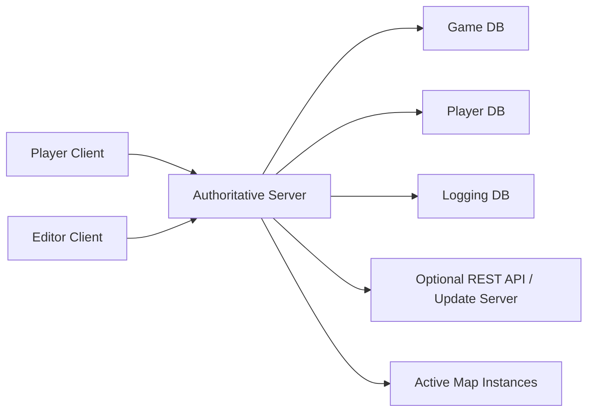

# Intersect Engine Research

This note researches [AscensionGameDev/Intersect-Engine](https://github.com/AscensionGameDev/Intersect-Engine)
and compares its MMO architecture against this Godot multi-server spike.

Intersect is useful prior art because it is a mature open-source 2D MMORPG
engine with a real editor, client, authoritative server, relational
persistence, custom packet networking, map simulation, chat, accounts, and
deployment-facing tooling.

It is not a direct template for this MVP because it is not Godot, does not use
Godot high-level multiplayer nodes, and does not appear to be organized as a
master/chat/world multi-server topology. Treat it as architecture research, not
as code to copy.

For the shared Godot project comparison, see
[Godot Multiplayer Project Comparison Matrix](godot-multiplayer-project-comparison.md).

## Executive Summary

Intersect is a C# / MonoGame MMORPG engine organized around three main user
facing processes:

- **Client**: the game executable players run.
- **Editor**: a Windows-only tool used by developers/admins to edit maps, game
  objects, and content.
- **Server**: the authoritative runtime that owns accounts, characters, maps,
  NPCs, events, chat, saves, and game simulation.

The official docs describe Intersect as a modern replacement for older 2D MMO
engines like Eclipse, Elysium, Mirage, and Xtremeworlds. They also describe the
downloaded package shape as `Client and Editor`, `Documentation`, and `Server`.

Source inspection of the current `main` branch shows a single authoritative
server using a custom LiteNetLib-based network stack, Entity Framework database
contexts, server-side map instances, explicit packet handlers, and explicit
packet senders. The server loads static game content into in-memory descriptor
lookups at boot, while player/account/guild/inventory data remains durable in
player data tables.

The strongest lessons for this Godot spike are:

- Use one authoritative owner for durable player data.
- Split game-content data, player data, and audit/log data.
- Keep static game definitions cached in memory after loading.
- Treat map/world simulation as server-owned.
- Send state based on interest/proximity, not to every peer.
- Add accounts, SQLite/MySQL, API endpoints, and live editing only after the
  minimal travel/chat architecture is proven.

The biggest non-lesson is also important: Intersect's custom packet system and
engine/editor design would overbuild this Godot proof-of-concept. This project
should continue using Godot RPCs, `MultiplayerSpawner`, and
`MultiplayerSynchronizer` for the current spike.

## Source Material Reviewed

Local source reviewed:

- Local checkout: `.logs/research/Intersect-Engine`
- Observed commit: `c98382bb9dbcc0b2842092c88e151a7d6e2ea3a4`
- Source date: 2026-05-26
- Repository root and project folders
- `README.md`, `REQUIREMENTS.md`, `Documentation/Features.md`
- `Intersect.Server/Program.cs`
- `Intersect.Server/appsettings.json`
- `Intersect.Server.Core/Core/Bootstrapper.cs`
- `Intersect.Server.Core/Core/LogicService.LogicThread.cs`
- `Intersect.Server.Core/Database/DbInterface.cs`
- `Intersect.Server.Core/Database/GameData/GameContext.cs`
- `Intersect.Server.Core/Database/PlayerData/PlayerContext.cs`
- `Intersect.Server.Core/Database/Logging/LoggingContext.cs`
- `Intersect.Server.Core/Maps/MapController.cs`
- `Intersect.Server.Core/Maps/MapInstance.cs`
- `Intersect.Server.Core/Networking/PacketHandler.cs`
- `Intersect.Server.Core/Networking/PacketSender.cs`
- `Intersect.Server/Networking/NetworkedPacketHandler.cs`
- `Intersect.Network/*`
- `Intersect.Client*`, `Intersect.Editor`, and `Intersect.SinglePlayer`

Public sources checked:

- [Intersect official documentation](https://docs.freemmorpgmaker.com/)
- [Intersect GitHub repository](https://github.com/AscensionGameDev/Intersect-Engine)
- [About](https://docs.freemmorpgmaker.com/en-US/project/about/)
- [Downloading Intersect](https://docs.freemmorpgmaker.com/en-US/start/download/)
- [Setup](https://docs.freemmorpgmaker.com/en-US/start/setup/)
- [Developer introduction](https://docs.freemmorpgmaker.com/en-US/developer/)
- [Database developer guide](https://docs.freemmorpgmaker.com/en-US/developer/advanced/database/)
- [Server configuration](https://docs.freemmorpgmaker.com/en-US/configuration/server/)
- [API v1 introduction](https://docs.freemmorpgmaker.com/en-US/api/v1/)
- GitHub issue/PR search for database migrations, world server scaling, and
  `GameDatabase` / `PlayerDatabase` references.

## Architecture At A Glance

| Area | Intersect Engine | This Godot spike |
| --- | --- | --- |
| Engine/runtime | C# / MonoGame | Godot 4 |
| Main topology | Client + editor + one authoritative server | One client, master server, chat server, three world servers |
| Networking | Custom packets over LiteNetLib | Godot high-level multiplayer over WebSocket peers |
| Replication | Custom packet senders and map interest logic | RPCs, `MultiplayerSpawner`, `MultiplayerSynchronizer` |
| Persistence | EF-backed relational stores, SQLite by default, MySQL support | No production persistence yet |
| Game data | Stored in database, loaded into descriptor lookups | Godot scenes/scripts/resources |
| Player data | Stored in player database | Not in scope yet |
| Editor | Dedicated live editor client | Godot editor only |
| Chat | Built into authoritative server | Separate chat server connection |
| World travel | Map/grid/map-instance travel inside one server | Client swaps active world server connection |
| Scaling model | Mature single-server/single-shard engine shape | Multi-role topology spike |

## Runtime Flow

The server is the center of the architecture. Clients and editors connect to
it. The server owns the runtime state, validates gameplay packets, persists
data, and sends packets back to interested clients.

## Repository Structure

The source is split into many C# projects. The important ones for architecture
research are:

- `Intersect.Client`: executable client shell.
- `Intersect.Client.Core` and `Intersect.Client.Framework`: client runtime,
  rendering, networking, UI, and framework abstractions.
- `Intersect.Editor`: Windows-only editor.
- `Intersect.Network`: packet/network abstractions and LiteNetLib backend.
- `Intersect.Server`: server executable and hosting/bootstrap entry.
- `Intersect.Server.Core`: server simulation, database, packets, entities,
  maps, game logic, web/API, and runtime services.
- `Intersect.Server.Framework`: server-facing framework/shared contracts.
- `Intersect.SinglePlayer`: local paired network path for single-player style
  execution.
- `Intersect.Tests*`: test projects.
- `assets`, `Examples`, `Documentation`, `scripts`, `targets`, `vendor`:
  assets, docs, build/deploy helpers, and submodules.

This is closer to a full engine source tree than a game project. That is
powerful, but it is not the amount of structure this Godot MVP needs.

## Server Startup

`Intersect.Server/Program.cs` creates a `FullServerContext`, assigns a
`NetworkFactory`, creates `ServerNetwork` with `NetworkConfiguration` using the
configured server port, wires network task dispatch through `ServerNetwork.Pool`,
and calls `Bootstrapper.Start(...)`.

`Bootstrapper` initializes the server context and calls database startup logic.
`DbInterface.InitDatabase(...)` loads game data and builds lookup caches before
the server begins acting as a world runtime.

Important takeaway: Intersect starts as a single role-specific server process.
It does not launch multiple world-role executables from one Godot project like
this spike does.

## Persistence Model

The official database guide states that Intersect has two main databases:

- **Game database**: items, maps, resources, events, and other game definitions.
- **Player database**: accounts and player-related state.

The current source has a broader config surface. `Intersect.Server/appsettings.json`
contains connection strings for:

- `Game`: `resources/gamedata.db`
- `Player`: `resources/playerdata.db`
- `Logging`: `resources/logging.db`
- `Identity`: `resources/identity.db`

So the current implementation still follows the core game/player split, but the
server also has separate logging and identity/API-related stores.

`GameContext` defines static content tables such as animations, crafting,
classes, events, items, maps, NPCs, projectiles, quests, resources, shops,
spells, variables, tilesets, and time.

`PlayerContext` defines user/player runtime tables such as users, bans, mutes,
refresh tokens, players, bank, friends, hotbar, inventory, quests, spells,
player variables, bags, guilds, guild bank, guild variables, and user variables.

`LoggingContext` tracks request logs, user activity, chat history, trade
history, and guild history.

`DbInterface` creates contexts, handles migration checks, loads all game
objects, and populates static lookup dictionaries such as item, NPC, spell,
quest, resource, class, and map descriptor caches. The source includes a useful
comment: database writes are considered rare, mostly player saves and editor
game changes, and player saves are offloaded as tasks.

### Persistence Lesson

For a future small MMORPG, Intersect is strong evidence for using a relational
database once accounts, inventory, guilds, logs, moderation, and migrations
matter. Resource/file storage can be fine for a local prototype or a small
single-process experiment, but Intersect's architecture expects durable schema,
relationships, migrations, indexes, and auditability.

For this Godot spike, persistence remains out of scope. The next smallest
reasonable step would be a master-owned SQLite spike with:

- accounts table
- characters table
- character location/world table
- chat/audit log table
- explicit save/load points

## Network Model

Intersect does not use Godot RPCs or high-level multiplayer nodes. It uses
custom packet classes and a custom network abstraction backed by LiteNetLib.

`PacketHandler` receives client packets such as:

- `LoginPacket`
- `MovePacket`
- `ChatMsgPacket`
- `CreateCharacterPacket`
- many gameplay/editor/admin packets

The server validates and handles these packets authoritatively. Movement is
server checked, and the server can send corrected entity positions back to the
client.

`PacketSender` is the opposite side: a large explicit sender layer that sends
entity data, maps, map entities, movement, player characters, map items, chat,
guild updates, and other state to the appropriate clients.

`NetworkedPacketHandler` handles editor/admin packet traffic, including editor
login, map updates, map creation/deletion/linking/unlinking, game object saves,
and broadcasting updated map/entity state to relevant users.

### Networking Lesson

Intersect proves the mature version of an MMO network stack: explicit messages,
server authority, custom interest management, and packet-level control.

For this Godot spike, that is intentionally too much. We should keep:

- RPCs for requests and confirmations.
- `MultiplayerSpawner` for player spawn/despawn.
- `MultiplayerSynchronizer` for small replicated state.
- Branch-local `MultiplayerAPI` instances for separate chat/world connections.

If the Godot project later outgrows high-level nodes, Intersect's packet
handler/sender split is a good conceptual model for the next layer.

## Map And Simulation Model

Intersect's map runtime is one of the most useful parts to study.

`LogicService.LogicThread` owns a logic thread pool used for NPCs, event
processing, map updating, projectiles, spell casting, guild updates, metrics,
and queued database work. It keeps `ActiveMapInstances` and recalculates active
map instances based on online player locations and surrounding maps.

`MapInstance` processes a single map instance. Its source comments explain that
the same map can be processed differently for different players or parties,
supporting dungeons, personal cutscenes, minigames, arenas, and similar
instanced content. A `Player` creates map instances when warping or crossing
map boundaries, and unused instances can be cleaned up once no players are on
the map or nearby surrounding maps.

This is not the same as this Godot spike's world-server transfer model.
Intersect keeps travel inside one authoritative server and one map/grid/instance
runtime. This spike disconnects from one world server and connects to another.

### Map Lesson

The concept worth borrowing is not the exact implementation. It is the
separation between:

- **map definition**: durable content loaded from the game database;
- **map instance**: runtime simulation layer;
- **interest area**: nearby maps/entities visible to a player;
- **transport**: packets sent only to interested clients.

A future Godot version could model each world server as owning many map
instances, while the master server owns character location and routing.

## Chat Model

Intersect's chat is handled inside the authoritative server packet flow rather
than as an independent chat process. `PacketHandler` handles `ChatMsgPacket`,
and `LoggingContext` includes `ChatHistory`.

This means Intersect is closer to "one shard server owns gameplay and chat" than
to this spike's separate persistent chat connection. That does not mean it lacks
chat features. It means chat is coupled to the main server runtime.

For this Godot project, keeping chat as a separate multiplayer branch remains
the correct MVP because the architectural question is specifically whether chat
can survive active world connection replacement.

## Editor Model

Intersect's editor is a privileged client that talks to the server. The server
has explicit editor/admin packet handling for map edits, game object saves, and
content changes. This lets content edits flow through the authoritative runtime
and persistence layer instead of being local-only files.

That is powerful for a real MMORPG toolchain. It is not something to implement
in this MVP. The Godot editor already serves as the content editor for this
spike.

## API And Update Server

The official API docs describe an optional REST API that can expose live server
info, external login/password validation, item grants, variables, chat, logs,
admin actions, and game object access.

The current appsettings include an enabled API section and update server
configuration. This is useful later for admin tooling and launcher/update flows,
but it is outside the Godot travel/chat MVP.

## Does Intersect Solve Multi-World Server Travel?

Not directly from the inspected source.

Intersect has:

- one authoritative server;
- many maps;
- map grids and surrounding maps;
- instanced maps;
- server-side warps and movement;
- chat and player data in the same server runtime.

This is not the same as:

- master server;
- independent chat server;
- multiple world server processes;
- client swaps world peers while keeping chat alive.

If a future project wanted Intersect-like maturity with Godot-style world
servers, the master server would likely own accounts, character location, and
handoff tokens, while each world server would own map simulation for its
assigned maps/instances. That is a different architecture than Intersect's
current single-server engine shape.

## What To Borrow Later

Borrow these ideas after the MVP is stable:

- **Authoritative persistence owner**: one master/database service should own
  account and character truth.
- **Split database concerns**: game content, player state, and logs should not
  be mashed into one vague data bucket.
- **Load static descriptors into RAM**: content definitions can be cached after
  startup and edited through controlled paths.
- **Interest management**: world servers should replicate nearby entities, not
  every entity to every client.
- **Map instances**: maps and runtime instances are different concepts.
- **Server-side validation**: movement, warps, inventory, chat commands, and
  combat should be validated server-side.
- **Audit logs**: chat, trade, moderation, and guild history become important
  earlier than expected.
- **Migration discipline**: schema changes need explicit migrations and tests
  once player data exists.
- **Optional admin API**: useful for dashboards, moderation, and external sites.

## What Not To Borrow Yet

Avoid these for the current spike:

- A full custom packet transport.
- A custom game editor.
- A complete account/auth system.
- A production database schema.
- A REST API.
- Launcher/update server tooling.
- Custom map-grid simulation.
- Large gameplay systems.
- GPL source copying.

These are valuable for research, but they would obscure the current Godot
question: can one shared Godot project run several WebSocket multiplayer roles
with persistent chat and swappable world connections?

## Comparison To This Project

| Question | Intersect answer | Godot spike answer |
| --- | --- | --- |
| Where does the player connect first? | Main authoritative server. | Master for routes, then chat and world branches. |
| Is chat independent from world travel? | No, chat is part of the main server packet flow. | Yes, chat uses its own multiplayer context. |
| Are there separate world server processes? | Not in the inspected architecture. | Yes, world 1, 2, and 3 are separate processes. |
| How is travel represented? | Map movement, warps, grids, and map instances inside one server. | Portal requests cause world peer replacement. |
| How are objects synchronized? | Explicit server packets and interest logic. | Godot RPCs plus high-level replication nodes. |
| How is player data stored? | Relational player database. | Not implemented yet. |
| How is game content stored? | Relational game database, cached into descriptors. | Godot scenes/scripts/resources. |
| How mature is it? | Full engine/toolchain. | MVP research spike. |

## Recommended Impact On This Godot MVP

No immediate code change is required from this research.

The current Godot architecture should stay intentionally small:

- Keep separate master, chat, and world roles.
- Keep chat independent from world replacement.
- Keep Godot high-level multiplayer nodes for spawning/synchronization.
- Keep portal travel log-driven and explicit.
- Keep persistence out of this MVP unless the next spike is specifically a
  master-owned SQLite character/location save.

The first Intersect-inspired follow-up worth doing is not custom networking. It
is a persistence spike:

1. Add master-owned SQLite.
2. Store accounts/characters/world location.
3. On world transfer, have master update character location.
4. On reconnect, route the client to the last saved world.
5. Log chat and transfer events.

## Concise Architecture Summary

Intersect is a C# / MonoGame 2D MMO engine where players run a client, admins
run an editor, and both connect to a single authoritative server. The server
owns gameplay, maps, chat, accounts, persistence, and simulation. It stores game
definitions in a game database, player/account/guild/inventory state in a
player database, logs in a logging database, and API/identity data in additional
server stores. It loads static game content into memory, runs active map
instances on server logic threads, receives custom LiteNetLib packets from
clients/editors, validates them, and sends explicit state packets back to only
the relevant clients.
