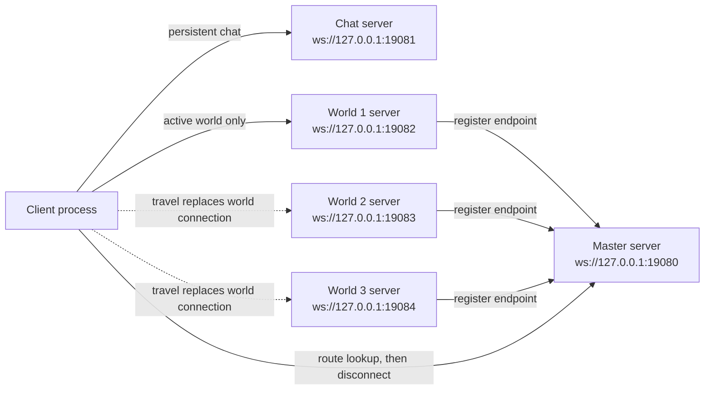

# Mini MMO Architecture Guide

This document explains the working multi-server Godot setup in this project and how it can be used as the seed for a small MMO-style architecture.

The project is intentionally small. It proves the shape:

- One Godot project.
- One shared exportable codebase.
- One client role.
- One master server role.
- One chat server role.
- Three world server roles.
- Native Godot high-level multiplayer over `WebSocketMultiplayerPeer`.
- Separate multiplayer contexts for master, chat, and the active world.
- Persistent chat while the active world connection is replaced.
- Inherited world scenes with portal-based server travel.
- Server-authority player spawning under a shared world scene root.

It is not a production framework. It has no login, database, matchmaking, ticketing, prediction, rollback, inventory, NPCs, or cloud orchestration.

## High-Level Model

The project uses one main Godot scene, `res://launcher/Launcher.tscn`. The launcher reads command-line arguments and instantiates the requested role scene.

```text
--role client
--role master
--role chat
--role world --world 1
--role world --world 2
--role world --world 3
```

Every role is a separate Godot process. The same project can run all roles because the launcher selects a role at startup.

The runtime topology looks like this:



The most important design rule is that chat and world networking are not sharing one global multiplayer peer. The client has sibling scene branches, and each branch has its own `MultiplayerAPI`.

```text
ClientRoot
  MasterNet
    MasterEndpoint
  ChatNet
    ChatEndpoint
  WorldNet
    WorldEndpoint
    WorldSceneRoot
  CanvasLayer
    StatusLabel
    ChatPanel
```

The branch-local APIs are assigned in `client/client_main.gd`:

```gdscript
master_api = MultiplayerAPI.create_default_interface()
chat_api = MultiplayerAPI.create_default_interface()
world_api = MultiplayerAPI.create_default_interface()
get_tree().set_multiplayer(master_api, get_node("MasterNet").get_path())
get_tree().set_multiplayer(chat_api, get_node("ChatNet").get_path())
get_tree().set_multiplayer(world_api, get_node("WorldNet").get_path())
```

That is the core Godot trick this spike validates. The client can replace the `WorldNet` peer without touching the `ChatNet` peer.

## Directory Map

```text
launcher/
  Launcher.tscn
  launcher.gd

client/
  ClientRoot.tscn
  client_main.gd
  chat/
    ChatPanel.tscn
    chat_panel.gd
  player/
    Player.tscn
    player.gd
  world/
    world.tscn
    world_1.tscn
    world_2.tscn
    world_3.tscn
    world_scene.gd
    portal_area.gd

server/
  master/
    MasterServer.tscn
    master_server.gd
  chat/
    ChatServer.tscn
    chat_server.gd
  world/
    WorldServer.tscn
    world_server.gd

shared/
  net_config.gd
  cli_args.gd
  master_endpoint.gd
  chat_endpoint.gd
  world_endpoint.gd

tools/
  run_smoke.ps1
  export_all.ps1
```

The separation is deliberately obvious:

- `client/` contains the playable view, player, chat UI, and world scenes.
- `server/master/` contains the world registry and route server process.
- `server/chat/` contains the chat server process.
- `server/world/` contains the shared world server process, parameterized by `--world`.
- `shared/` contains constants and RPC endpoint scripts used by both sides.
- `tools/` contains CLI export and smoke orchestration.

## Shared Configuration

`shared/net_config.gd` is the one place that defines local ports, URLs, world scene paths, and the transfer graph.

Current local ports:

```text
master: 19080
chat:   19081
world1: 19082
world2: 19083
world3: 19084
```

Current transfer graph:

```text
World 1 -> World 2
World 2 -> World 1
World 1 -> World 3
World 3 -> World 1
```

For this spike, `NetConfig` is enough. A real mini MMO would eventually replace some of this with database-backed world records, health status, region, population, and shard allocation.

## Launcher Role Selection

`launcher/launcher.gd` reads `OS.get_cmdline_user_args()`, checks `--role`, and instantiates the matching root scene:

```text
client -> res://client/ClientRoot.tscn
master -> res://server/master/MasterServer.tscn
chat   -> res://server/chat/ChatServer.tscn
world  -> res://server/world/WorldServer.tscn
```

This keeps the Godot project simple:

- One `project.godot`.
- One main scene.
- One export preset.
- Same binary can become any role by changing args.

This is the simplest useful setup for a multi-role MVP.

## Master Server

The master server is a small registry. It is not an account server, lobby server, or matchmaking service.

Files:

- `server/master/MasterServer.tscn`
- `server/master/master_server.gd`
- `shared/master_endpoint.gd`

Startup behavior:

1. Creates a `MultiplayerAPI`.
2. Assigns it to the `MasterNet` branch.
3. Creates a `WebSocketMultiplayerPeer` server on `127.0.0.1:19080`.
4. Prints `MASTER_READY`.

World registration behavior:

1. A world server connects to master using its own `MasterNet` branch.
2. The world calls `register_world(world_id, endpoint, allowed_targets)`.
3. Master stores the registered endpoint by world ID.
4. Master prints `MASTER_WORLD_REGISTERED id=<id>`.
5. Master acknowledges the world.

Client route behavior:

1. The client connects to master.
2. The client calls `request_routes()`.
3. Master replies with the live registered worlds, chat endpoint, and initial world.
4. The client disconnects master by assigning `OfflineMultiplayerPeer`.

For this MVP, the master is only needed for initial route discovery. Chat and world traffic do not go through master.

## Chat Server

The chat server is intentionally separate from all world servers.

Files:

- `server/chat/ChatServer.tscn`
- `server/chat/chat_server.gd`
- `shared/chat_endpoint.gd`
- `client/chat/ChatPanel.tscn`
- `client/chat/chat_panel.gd`

Startup behavior:

1. Creates a `MultiplayerAPI`.
2. Assigns it to the `ChatNet` branch.
3. Creates a `WebSocketMultiplayerPeer` server on `127.0.0.1:19081`.
4. Prints `CHAT_READY`.

Chat behavior:

1. Client connects on `ChatNet`.
2. The chat panel enables its `LineEdit`.
3. User presses Enter in the input.
4. Client calls `send_chat.rpc_id(1, message)`.
5. Server reads `multiplayer.get_remote_sender_id()`.
6. Server broadcasts `receive_chat(sender_id, message)` to clients.
7. Client displays the sender peer ID and message.

The packed chat UI is a `PanelContainer` with:

```text
ChatPanel
  VBox
    Output: RichTextLabel
    Input: LineEdit
```

There is no send button. Press Enter to send.

The important architectural point is that `ChatNet` is not touched during world travel. If the world peer is replaced, chat remains connected.

## World Servers

There are three world server processes, all using the same world server scene and script.

Files:

- `server/world/WorldServer.tscn`
- `server/world/world_server.gd`
- `shared/world_endpoint.gd`
- `client/world/world.tscn`
- `client/world/world_1.tscn`
- `client/world/world_2.tscn`
- `client/world/world_3.tscn`

Each world server is configured by `--world`.

```powershell
--role world --world 1
--role world --world 2
--role world --world 3
```

Startup behavior:

1. Creates a `world_api` for the `WorldNet` branch.
2. Creates a `master_api` for the `MasterNet` branch.
3. Reads `--world`.
4. Loads the matching inherited world scene under `WorldNet/WorldSceneRoot`.
5. Starts a WebSocket server on that world's port.
6. Connects to master.
7. Registers its world ID, URL, scene path, and allowed transfer targets.

The world server has two independent multiplayer responsibilities:

- `WorldNet`: accepts gameplay clients for that world.
- `MasterNet`: connects upward to master for registry/heartbeat behavior.

This mirrors a real MMO split: world servers are independent game processes, but they report availability to a control-plane service.

## World Scenes

`client/world/world.tscn` is the base world scene.

```text
World
  SpawnRoot
  MultiplayerSpawner
```

`world_1.tscn`, `world_2.tscn`, and `world_3.tscn` inherit from the base scene and override only:

- `world_id`
- `world_name`
- `world_color`
- `portal_targets_csv`

Runtime-generated visuals:

- Marker sprites use `res://icon.svg` with world color modulation.
- Portal sprites use `res://icon.svg` with target color modulation.
- The player uses `res://icon.svg` through `Player.tscn`.
- Labels identify the current world and portal targets.

The same inherited world scene is mounted on both the client and the world server at:

```text
WorldNet/WorldSceneRoot
```

That shared path matters for high-level multiplayer nodes. `MultiplayerSpawner` and `MultiplayerSynchronizer` depend on matching scene paths and authority rules.

## Player Spawning

`client/player/Player.tscn` is a `CharacterBody2D` with:

- A `Sprite2D` using `res://icon.svg`.
- A `CollisionShape2D`.
- Collision layer `2`, so players do not collide with each other in the current setup.
- A `MultiplayerSynchronizer` configured for `.:position` in the current player scene.

`client/player/player.gd` is intentionally tiny:

- Reads movement from `Input.get_vector("ui_left", "ui_right", "ui_up", "ui_down")`.
- Sets `velocity`.
- Calls `move_and_slide()`.
- Does not use gravity.
- Only moves if the node is local multiplayer authority.

Players are spawned through the base world scene's `MultiplayerSpawner`.

Server-side flow:

1. A peer connects to a world server.
2. `world_server.gd` receives `world_api.peer_connected`.
3. The server calls `world_scene.spawn_player(peer_id)`.
4. `world_scene.gd` calls `MultiplayerSpawner.spawn(...)`.
5. Spawn data includes:
   - `peer_id`
   - `position`
6. `_spawn_player_from_data()` creates `Player.tscn`.
7. The spawned node is named `Player_<peer_id>`.
8. Authority is assigned to that peer.
9. The node is added under `SpawnRoot`.

Client-side flow:

1. Godot receives the spawner event.
2. The same `_spawn_player_from_data()` function runs locally.
3. The same `Player_<peer_id>` node is created under `SpawnRoot`.
4. The local player can move only if its authority matches the local peer.
5. Remote players are present but do not consume local input.

The spawn data is important. Without passing the spawn position through `MultiplayerSpawner.spawn(data)`, clients can instantiate spawned players at default scene positions such as `(0, 0)`.

## Movement Synchronization

The current `Player.tscn` includes a `MultiplayerSynchronizer` for `position`.

The intended authority model is:

- The local player owns its own `Player_<peer_id>` node.
- The local player moves through input.
- The `MultiplayerSynchronizer` replicates that authority-owned `position` to remote peers.
- Remote player nodes do not run input movement because they are not local authority.

Two pitfalls matter here:

1. If every client moves every `Player` node, players will fight each other and snap or disappear.
2. If remote synchronized player bodies can trigger portals, one player's travel can appear to make other clients travel.

This project avoids the second pitfall in `portal_area.gd`:

```gdscript
func _on_body_entered(body: Node) -> void:
    if body is CharacterBody2D and _is_local_authority_body(body):
        activate()
```

Only the local authority player can activate a portal on that client. Synchronized remote player bodies can overlap portal areas visually, but they should not request travel for the local client.

## Portal Travel

Portals are client-visible `Area2D` nodes generated by `world_scene.gd`.

`portal_targets_csv` controls which portals exist:

```text
World 1: "2,3"
World 2: "1"
World 3: "1"
```

Manual travel flow:

1. Local authority player enters a portal.
2. `portal_area.gd` emits `portal_entered(target_world)`.
3. `world_scene.gd` emits `portal_requested(target_world)`.
4. `client_main.gd` receives the request.
5. Client checks whether the target world was registered by master.
6. Client calls `world_endpoint.request_transfer.rpc_id(1, target_world)` on the current world server.
7. Current world server checks `NetConfig.allowed_targets(server_world_id)`.
8. If allowed, server sends `approve_transfer(target_world, endpoint)`.
9. Client disconnects the old world peer.
10. Client unloads the old world scene.
11. Client loads the target world scene locally.
12. Client connects `WorldNet` to the target world server.
13. Client requests and receives target world state.
14. Chat remains connected on `ChatNet`.

The key implementation detail is that travel replaces only this branch:

```text
ClientRoot/WorldNet
```

It does not replace:

```text
ClientRoot/ChatNet
```

That is why chat can survive world transfer.

## Scene Paths And RPC Rules

Godot high-level multiplayer is sensitive to paths.

For RPC endpoints, both sides must have matching node paths and scripts. This project keeps the important paths stable:

```text
MasterNet/MasterEndpoint
ChatNet/ChatEndpoint
WorldNet/WorldEndpoint
WorldNet/WorldSceneRoot
```

For high-level spawning/synchronization, client and server both load the inherited world scene under `WorldNet/WorldSceneRoot`, with spawned players under:

```text
WorldNet/WorldSceneRoot/<WorldN>/SpawnRoot/Player_<peer_id>
```

That matching structure is why the spawner can replicate player nodes.

Rules to keep in mind:

- Do not nest custom multiplayer branches.
- Set branch multiplayer APIs before relying on branch-local RPC/spawner/synchronizer behavior.
- Keep RPC method signatures and annotations identical on both sides.
- Client-to-server RPC methods need `@rpc("any_peer")`.
- Server-to-client RPC methods usually use authority RPCs.
- Use stable node names for nodes involved in RPC or replication.
- Treat world travel as teardown/rebuild of the world branch, not as carrying live synchronized nodes between servers.

## Manual Testing In Godot

Use:

```text
Debug > Customize Run Instances...
```

For the full local topology with two visible clients:

```text
main editor run: visible client
instance 1:       visible client
instance 2:       --headless -- --role master
instance 3:       --headless -- --role world --world 1
instance 4:       --headless -- --role world --world 2
instance 5:       --headless -- --role world --world 3
instance 6:       --headless -- --role chat
```

Expected manual behavior:

- Both clients connect to master.
- Both clients connect to chat if chat is running.
- Both clients connect to World 1.
- Both clients spawn `Player_<peer_id>` nodes under `SpawnRoot`.
- Movement is top-down with WASD or arrows.
- Chat input sends on Enter.
- Chat lines show the sender peer ID.
- Entering a portal transfers only the local client.
- Other clients can stay in the previous world.
- Chat remains connected after travel.

For partial topology debugging, manual mode is relaxed:

- Chat is optional.
- World 2 and World 3 are optional.
- Portals to missing worlds are hidden.

That means this is valid for quick client/world debugging:

```text
--headless -- --role master
--headless -- --role world --world 1
visible client
```

## CLI Testing

Set your local Godot path:

```powershell
$godot = "C:\Programming_Files\Godot\Godot_v4.6.3-stable_win64.exe\Godot_v4.6.3-stable_win64.exe"
```

Launch roles manually:

```powershell
& $godot --headless --path . -- --role master
& $godot --headless --path . -- --role chat
& $godot --headless --path . -- --role world --world 1
& $godot --headless --path . -- --role world --world 2
& $godot --headless --path . -- --role world --world 3
& $godot --path . -- --role client
```

Run the automated smoke test:

```powershell
powershell -ExecutionPolicy Bypass -File tools\run_smoke.ps1
```

Run two smoke clients:

```powershell
powershell -ExecutionPolicy Bypass -File tools\run_smoke.ps1 -ClientCount 2
```

Expected smoke markers:

```text
MASTER_READY
CHAT_READY
WORLD_READY id=1
WORLD_READY id=2
WORLD_READY id=3
MASTER_WORLD_REGISTERED id=1
MASTER_WORLD_REGISTERED id=2
MASTER_WORLD_REGISTERED id=3
SMOKE_STEP client connected to chat
SMOKE_STEP client confirmed initial world 1
SMOKE_STEP confirmed world 2 with chat alive
SMOKE_STEP confirmed world 1 with chat alive
SMOKE_STEP confirmed world 3 with chat alive
SMOKE_PASS
```

Logs are written under `.logs/`.

## Exporting

The project uses one Windows Desktop export preset.

Export all role-labeled artifacts:

```powershell
powershell -ExecutionPolicy Bypass -File tools\export_all.ps1
```

Outputs:

```text
builds/client/client.exe
builds/master/master.exe
builds/chat/chat.exe
builds/world1/world1.exe
builds/world2/world2.exe
builds/world3/world3.exe
```

Each artifact is the same exported Godot project copied into a role-labeled location. Role behavior still comes from command-line arguments.

Run exported smoke:

```powershell
powershell -ExecutionPolicy Bypass -File tools\run_smoke.ps1 -UseExported
```

This proves that the shared project exports and the same topology runs outside the editor.

## How To Add A New World

For an MVP-style fourth world:

1. Add a port in `NetConfig.WORLD_PORTS`.
2. Add allowed targets in `NetConfig.allowed_targets()`.
3. Create `client/world/world_4.tscn` inherited from `client/world/world.tscn`.
4. Override:
   - `world_id = 4`
   - `world_name = "World 4"`
   - `world_color`
   - `portal_targets_csv`
5. Update `NetConfig.world_scene_path()` if the naming convention changes.
6. Add a launch line:
   - `--headless -- --role world --world 4`
7. Update smoke tooling if the new world is required for automated validation.

Do not duplicate `world_server.gd`. One world server script should stay parameterized by `--world`.

## How To Evolve This Into A Mini MMO

The current architecture is a seed. A small MMO can grow from it by keeping the same separation of responsibilities.

Suggested next layers:

- Keep the launcher/role pattern while prototyping.
- Turn master into a registry plus allocation service.
- Let worlds register health, population, max players, shard ID, region, and map name.
- Add authenticated login before route lookup.
- Add short-lived transfer tickets before moving between worlds.
- Persist character state before transfer and restore it on the target world.
- Add server-side validation for spawn position and portal entry.
- Add local/global chat channels.
- Add world-local chat by connecting chat identity to world membership.
- Add reconnect behavior for chat and world separately.
- Add interest management before adding lots of synchronized entities.
- Build editor-friendly context nodes later, after this explicit version stays understandable.

Keep this boundary:

```text
control plane: master/auth/allocation
social plane: chat
simulation plane: world servers
client plane: visible world, input, UI, travel requests
```

That boundary is the most important thing to preserve.

## Known Limitations And Pitfalls

This project is intentionally local and minimal.

Known limitations:

- No auth.
- No database.
- No persistence.
- No transfer tickets.
- No server-side movement validation.
- No production orchestration.
- No reconnect UX.
- No latency or packet-loss handling.
- No world population balancing.
- No security around chat or transfer requests.

Godot-specific pitfalls discovered during the spike:

- Nested custom multiplayer branches are not allowed.
- RPC node paths and method signatures must match.
- `MultiplayerSpawner` needs matching spawn paths on server and clients.
- Initial spawn properties should be passed through spawn data.
- Authority must be deterministic and reapplied after spawn/name assignment.
- Peer IDs belong to a connection. Do not assume they are global account IDs.
- Remote synchronized bodies can trigger local physics areas unless filtered.
- Travel should replace the world branch, not move live synchronized nodes to a different server peer.
- A transient WebSocket `ready_state != STATE_OPEN` send warning can appear during startup/teardown if RPCs race connection readiness; it can be harmless if the higher-level smoke still passes.
- Manual mode route lookup is a startup snapshot. If a world registers after the client already fetched routes, restart the client or add route refresh logic.

## Why This Structure Was Chosen

This structure wins for the spike because it is boring in the right places:

- One Godot project is easy to inspect.
- One launcher makes export simple.
- Role folders keep responsibilities visible.
- Shared endpoint scripts reduce RPC drift.
- Sibling multiplayer branches prove multiple simultaneous connections.
- World travel replaces only the world branch.
- Chat persistence is tested directly.
- World scenes are inherited rather than copied.
- The smoke script proves the full topology with logs.

The result is small enough to throw away, but concrete enough to guide a real mini MMO prototype.

