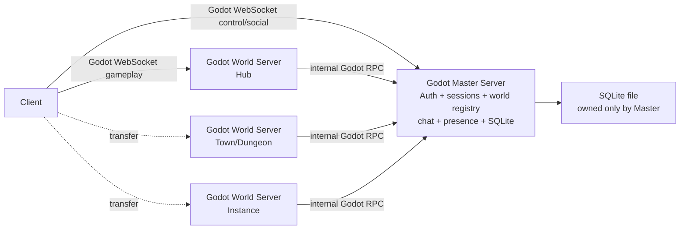

# VirtuCade Custom Godot, SQLite, And PocketBase Decision

Date: 2026-06-07

This document revisits the infrastructure direction after the Nakama spike and
the PocketBase/SQLite research. It focuses on the current product goal:

- small-scale production MMO, roughly 100-200 CCU;
- vertical scaling first;
- minimal learning curve and minimal service count;
- one Godot codebase if practical;
- Godot headless world servers own gameplay;
- Tiny MMO is the closest prior-art direction, but with fewer services;
- no fleet, matchmaking, relay multiplayer, Docker, dedicated database service,
  or separate backend codebase unless the benefit is large enough.

## Decision

Prefer this as the next architecture:

```text
One Godot project
  client role
  master role
  world role

Godot Master Server
  auth/session/control/social/orchestration
  SQLite database owner
  world registry and transfer tickets
  global chat and presence first

Godot World Servers
  direct gameplay sockets
  one scene/world/instance per process first
  no direct durable database writes
```

In short:

```text
Recommended first production slice:
Custom Godot Master Server + embedded SQLite + Godot World Servers
```

PocketBase should be treated as an optional backend accelerator, not the default
next step. It is useful if its auth/admin/REST scaffolding becomes worth the
extra process or Go codebase. It does not match the strongest workflow goal as
well as SQLite embedded into the Godot master.

Nakama remains useful research, but it is no longer the best first path if the
highest-value constraint is "master server, world servers, database, and client
all in the same codebase."

## Why The Recommendation Changed

The earlier Nakama-first recommendation optimized for not rebuilding backend
features. That was a valid axis, but it underweighted the workflow cost:

- Nakama brings a separate database, runtime modules, server APIs, Docker or
  native deployment work, and a separate mental model.
- PocketBase brings Go/PocketBase deployment or a sidecar service unless the
  whole master backend moves to Go.
- A custom Godot master with SQLite keeps the project close to the proven
  multi-server spike and Godot Tiny MMO's one-project workflow.

For VirtuCade's current scope, the simplest serious production shape is not "no
backend." It is "the backend is the Godot master server."

## Recommended Topology

Collapse Gateway, Master, and Social into one Godot Master process for the
first production slice:



Conceptual roles still exist:

| Conceptual role | First production implementation |
| --- | --- |
| Gateway | Master's public client control connection |
| Master | Same Godot master process |
| Social | Same Godot master process at first |
| Database | SQLite embedded in the master process |
| World | Separate Godot headless processes |

Split Gateway or Social later only if measured pressure demands it.

## What The Master Should Own

The Godot Master should own:

- guest sessions;
- login/register/account sessions;
- character records;
- password hash records;
- transfer tickets;
- world registry and heartbeats;
- world startup/shutdown decisions;
- global chat and presence;
- durable social records when they appear;
- SQLite migrations, backups, and writes.

The Master should not simulate gameplay maps. It is the control plane and data
owner.

## What Worlds Should Own

World servers should own:

- movement;
- collisions;
- NPCs and runtime entities;
- local combat;
- portal overlap checks;
- active scene state;
- temporary loot/effects;
- player spawn/despawn inside that world.

World servers should ask Master for:

- ticket validation;
- character snapshot on join;
- transfer approval;
- durable save on logout, transfer, checkpoint, timed dirty save, and graceful
  shutdown.

They should not write account, inventory, currency, character, or ticket rows
directly to SQLite or PocketBase.

## SQLite As Embedded Master Database

SQLite is the best database fit if the Godot Master is the only durable writer.

Official SQLite docs say:

- SQLite is a local embedded database, not a separate DB server.
- Multiple connections/processes may read the same file.
- Only one writer can modify a database file at a time.
- WAL mode allows readers and a writer to proceed concurrently.
- Many concurrent writers or network-filesystem access are reasons to consider
  a client/server database.

That is acceptable for this architecture because the Master serializes writes
and the write rate should be low:

- login/register;
- guest entry;
- world join/transfer;
- chat persistence if enabled;
- periodic dirty character saves;
- logout/disconnect;
- audit events.

Do not write movement ticks, animation state, collision state, or every chat
fanout to SQLite.

### SQLite Configuration

Use:

```sql
PRAGMA journal_mode = WAL;
PRAGMA busy_timeout = 5000;
PRAGMA foreign_keys = ON;
PRAGMA synchronous = NORMAL;
```

Operational rules:

- keep transactions short;
- batch dirty character saves;
- run checkpoint/backup tests;
- never put the writable database on a network filesystem;
- keep the database on the same host as the Master;
- write explicit migrations;
- keep static game data in Resources or read-only SQLite tables;
- keep active player/session state in RAM.

### Godot SQLite Integration

The practical Godot 4 option is the `2shady4u/godot-sqlite` GDExtension. Its
README describes Godot 4.x support, install through Asset Library or releases,
raw SQL queries, parameter bindings, multiple connections, and dedicated-server
notes.

This is still a native addon dependency. That is real cost, but it is smaller
than adding a complete backend service if the goal is a Godot-centered workflow.

Recommended layout:

```text
server/master/db/
  database_service.gd
  migrations/
    001_init.sql
    002_characters.sql
  repositories/
    account_repository.gd
    character_repository.gd
    ticket_repository.gd
    chat_repository.gd
```

Use a single `DatabaseService` node as the only code path that opens the write
connection.

## PocketBase Compared With SQLite

PocketBase is not "just SQLite." It is a Go backend framework/application that
uses SQLite internally and provides backend features around it.

PocketBase can provide:

- auth collections and password/OAuth/OTP/MFA flows;
- stateless auth tokens;
- generated REST-ish record APIs;
- API rules and filters;
- admin dashboard;
- file uploads;
- collection migrations;
- Go hooks and custom routes;
- realtime record subscriptions.

SQLite alone provides:

- embedded database file;
- SQL;
- transactions;
- indexes;
- constraints;
- backups;
- very low operational overhead.

### PocketBase Benefits For VirtuCade

PocketBase's real value over raw SQLite is not gameplay persistence. Its value
is scaffolding:

- less custom account/auth API code;
- built-in admin UI for inspecting users and records;
- easier CRUD/admin workflows;
- built-in password handling;
- OAuth/email-related auth paths;
- API rules for simple access control;
- standard REST-ish access for tools and web UI.

If building secure login, admin tooling, password reset, OAuth, and a web-facing
REST API inside Godot becomes the painful part, PocketBase becomes attractive.

### PocketBase Costs For VirtuCade

PocketBase adds costs that directly hit the current goal:

- it is another process unless the master backend is Go;
- embedding it means writing a Go master backend, not a Godot master;
- it is pre-1.0 and the docs warn that full backward compatibility is not
  guaranteed before v1.0;
- it uses SQLite and does not support replacing SQLite with Postgres out of the
  box;
- its auth tokens are stateless and there are no traditional server-side
  sessions;
- realtime is record subscription, not a Godot gameplay socket or a full
  MMO-social server;
- game-specific rules still have to be written;
- world registry, transfer tickets, guest hub policy, character save
  boundaries, and world-server trust do not come built in.

For this project, PocketBase is an auth/admin accelerator, not a replacement
for the Master.

## PocketBase Inside Godot

PocketBase should not be embedded inside a Godot headless process for the
production architecture.

The linked Godot/PocketBase plugin is a GDScript integration layer that points
Godot at a PocketBase server URL. It provides collection/auth helper methods for
calling a PocketBase backend. That is useful client integration, but it is not
PocketBase running inside Godot.

Practical options:

| Shape | Reality | Verdict |
| --- | --- | --- |
| Godot calls PocketBase over HTTP | Feasible with `HTTPRequest` or a wrapper plugin | Useful if PocketBase is a sidecar/backend |
| Godot starts PocketBase as a child process | Feasible with process APIs | Still a separate service, just supervised by Godot |
| PocketBase embedded into Godot via GDExtension/custom module | Theoretically possible with native/Go runtime plumbing | Reject as unsupported complexity |
| Rewrite PocketBase features in GDScript | Possible | Then it is no longer PocketBase |
| Embed SQLite into Godot | Feasible with SQLite GDExtension | Recommended |

The whole point of PocketBase is that SQLite is embedded inside the PocketBase
Go process. It does not mean PocketBase can be dropped into any arbitrary host
process like a SQLite library.

If you want embedded persistence inside Godot, use SQLite directly.

## Should World Servers Access The Database Directly?

No for normal durable game state.

### Direct SQLite Access From Worlds

It can work technically when all processes are on the same machine and the
database file is local. SQLite supports multiple processes opening the same DB
file, multiple readers, and one writer at a time.

But it is a poor authority boundary:

- every world needs DB schema knowledge;
- every world needs busy/retry/transaction handling;
- every world can race on the same character/inventory/ticket rows;
- future multi-machine deployment becomes harder;
- save rules spread across many scripts;
- auth/session invariants become harder to audit.

Use this only for read-only static data or rare operational experiments.

### Direct PocketBase Access From Worlds

This is safer than sharing a SQLite file because PocketBase remains the DB
server, but it still spreads authority:

- each world needs privileged service credentials;
- validation logic can be duplicated across worlds;
- superuser/server token leakage becomes a major risk;
- world bugs can mutate records directly;
- high-volume writes still funnel into PocketBase's SQLite writer.

Prefer:

```text
World -> Master: save/load/transfer command
Master -> SQLite: transaction
```

or, if PocketBase is adopted:

```text
World -> Master custom route
Master/PocketBase -> records transaction
```

## HTTP Login/Register Versus Live Master Connection

HTTP is standard for login/register, but pure Godot does not provide a full
high-level HTTP server primitive. Godot has `HTTPRequest` and `HTTPClient` for
making HTTP requests, and lower-level networking primitives such as `TCPServer`
if you want to implement a server. Hand-rolling public HTTP parsing, TLS,
headers, body limits, and rate limits in GDScript is not a good first move.

For the custom Godot-first architecture, use the existing live Master connection
first:

```text
Client -> Master WebSocket/Godot RPC: request_guest_entry
Client -> Master WebSocket/Godot RPC: register
Client -> Master WebSocket/Godot RPC: login
Client -> Master WebSocket/Godot RPC: request_transfer
Client -> Master WebSocket/Godot RPC: send_global_chat
```

This gives HTTP-like request/response behavior without a second protocol.

Add HTTP later if one of these becomes true:

- you need browser/web account pages outside the Godot client;
- you need external tooling to call public APIs;
- you want standard reverse-proxy rate limiting at the edge;
- you adopt PocketBase or a small Go facade.

## Authentication Caveat

The strongest argument for PocketBase is authentication, not the database.

If building custom Godot auth, do not store plaintext passwords and do not use
plain SHA-256 as the password hash. OWASP recommends modern slow password
hashing such as Argon2id, with bcrypt/PBKDF2 as alternatives depending on
environment.

Godot's built-in `HashingContext` supports fast hashes like SHA-256, which are
useful for files and signatures but are not password-storage algorithms.

So a custom Godot auth implementation needs one of these:

- an Argon2id/bcrypt/scrypt native addon;
- a tiny local auth helper;
- PocketBase for auth only;
- account login deferred until the secure hashing path is solved.

This is the one place where "all GDScript" can become dangerous. The database
can be simple. Password storage cannot be casual.

## Orchestration In The Custom Godot Architecture

Earlier research rejected a Godot-only orchestrator in the Nakama branch because
that process existed only to supervise worlds. In the custom architecture, the
Master already exists and already owns world registry, sessions, and tickets.

So using the Godot Master to start/stop local world processes is reasonable for
the first production slice.

Recommended flow:

```text
1. Client asks Master for hub entry.
2. Master ensures the hub world process exists.
3. World starts and registers with Master.
4. Master issues a short-lived entry ticket.
5. Client connects directly to the world.
6. World validates ticket with Master.
7. World reports population/heartbeat.
8. Master stops the world after 0 players for X seconds.
```

Implementation choices:

| Choice | Use when |
| --- | --- |
| `OS.create_process` / `OS.execute_with_pipe` from Master | Local Windows/Linux development and first single-VPS deployment |
| systemd transient units behind Master | Later Linux production hardening |
| separate Go orchestrator | If Master stops being Godot or process supervision needs to be isolated |
| fleet provider | Not needed for one location and 100-200 CCU |

The key is that Master remains the owner of the lifecycle decision even if a
Linux process manager eventually performs the launch.

## Option Comparison

| Option | Fit for current goal | Main upside | Main cost | Verdict |
| --- | --- | --- | --- | --- |
| Godot Master + SQLite | Strongest | One codebase, embedded DB, simple local tests/deploy | Build auth/admin/migrations yourself | Recommended next |
| Godot Master + PocketBase sidecar | Medium | PocketBase auth/admin/REST while Master stays Godot | Extra service, split data logic | Keep as fallback |
| Go/PocketBase Master + Godot worlds | Medium | One backend binary with PocketBase framework features | Master leaves Godot codebase | Good if auth/admin wins |
| PocketBase embedded in Godot | Weak | The desired "one process" idea | Unsupported native/Go bridge complexity | Reject |
| Worlds write SQLite directly | Weak | Fewer Master round trips | Bad authority boundary and writer contention | Avoid |
| Worlds write PocketBase directly | Medium-low | Easy REST persistence | Credential sprawl and duplicated rules | Avoid for durable game state |
| Nakama + Godot worlds | Medium-low for current goal | Many backend/social features | High learning curve and extra stack | Pause |

## Recommended First Production Slice

Build this next:

```text
Godot Master
  - SQLite DatabaseService
  - guest sessions
  - account/session skeleton
  - world registry
  - world process ensure/idle shutdown
  - transfer ticket issue/validate
  - global chat/presence

Godot World
  - register/heartbeat to Master
  - validate entry ticket before spawn
  - save/load via Master commands
  - portal transfer through Master

Godot Client
  - connect to Master first
  - guest entry into hub
  - persistent Master chat/control connection
  - direct active World connection
  - login/register through Master connection once secure auth exists
```

The first acceptance test:

1. Start Master.
2. Client connects to Master as guest.
3. Master starts hub world on demand.
4. Hub registers with Master.
5. Master issues hub ticket.
6. Client connects to hub and spawns as ghost guest.
7. Client sends global chat through Master.
8. Guest portal to non-hub is rejected.
9. Client logs in or uses a dev-auth account.
10. Master issues non-hub ticket.
11. Target world starts on demand.
12. Client transfers to target world.
13. World validates ticket with Master.
14. Master saves character location.
15. Worlds shut down after 0 players for X seconds.

## When To Revisit PocketBase

Revisit PocketBase if any of these become true:

- secure auth is taking too long;
- admin UI becomes important;
- account recovery, OAuth, or email verification matters soon;
- external web tools need REST-ish APIs;
- the Master's database/editor tooling becomes painful;
- you are willing to make the Master a Go/PocketBase backend.

If PocketBase is adopted, prefer either:

```text
Go/PocketBase Master Backend + Godot World Servers
```

or:

```text
Godot Master + standalone PocketBase sidecar for auth/admin records
```

Do not pursue PocketBase-in-Godot as the production architecture.

## When To Revisit Postgres

SQLite should be enough for this target if Master owns writes. Revisit Postgres
or another client/server database if:

- multiple backend services need direct writes;
- worlds move to multiple machines and must write durable data directly;
- write transactions queue badly under measured load;
- chat/audit data becomes high volume;
- admin/reporting workflows outgrow SQLite;
- high availability becomes a real requirement.

## Source Links

PocketBase:

- [PocketBase docs introduction](https://pocketbase.io/docs/)
- [PocketBase Go overview](https://pocketbase.io/docs/go-overview/)
- [PocketBase Go routing](https://pocketbase.io/docs/go-routing/)
- [PocketBase Go database](https://pocketbase.io/docs/go-database/)
- [PocketBase Go record operations](https://pocketbase.io/docs/go-records/)
- [PocketBase authentication](https://pocketbase.io/docs/authentication/)
- [PocketBase collections](https://pocketbase.io/docs/collections/)
- [PocketBase API rules and filters](https://pocketbase.io/docs/api-rules-and-filters/)
- [PocketBase records API](https://pocketbase.io/docs/api-records/)
- [PocketBase realtime API](https://pocketbase.io/docs/api-realtime/)
- [PocketBase going to production](https://pocketbase.io/docs/going-to-production/)
- [PocketBase FAQ](https://pocketbase.io/faq/)
- [Godot PocketBase integration plugin](https://github.com/ferter3006/godot_pocketbase_integration_plugin)

SQLite:

- [SQLite isolation](https://www.sqlite.org/isolation.html)
- [SQLite write-ahead logging](https://www.sqlite.org/wal.html)
- [SQLite appropriate uses](https://www.sqlite.org/whentouse.html)
- [SQLite serverless behavior](https://www.sqlite.org/serverless.html)
- [SQLite FAQ, multiple processes](https://www.sqlite.org/faq.html#q5)

Godot:

- [Godot WebSocketMultiplayerPeer](https://docs.godotengine.org/en/stable/classes/class_websocketmultiplayerpeer.html)
- [Godot HTTPClient](https://docs.godotengine.org/en/stable/classes/class_httpclient.html)
- [Godot OS process APIs](https://docs.godotengine.org/en/stable/classes/class_os.html)
- [Godot GDExtension](https://docs.godotengine.org/en/stable/tutorials/scripting/gdextension/index.html)
- [2shady4u/godot-sqlite](https://github.com/2shady4u/godot-sqlite)
- [Godot-SQLite Asset Library](https://godotengine.org/asset-library/asset/1686)

Security:

- [OWASP Password Storage Cheat Sheet](https://cheatsheetseries.owasp.org/cheatsheets/Password_Storage_Cheat_Sheet.html)
