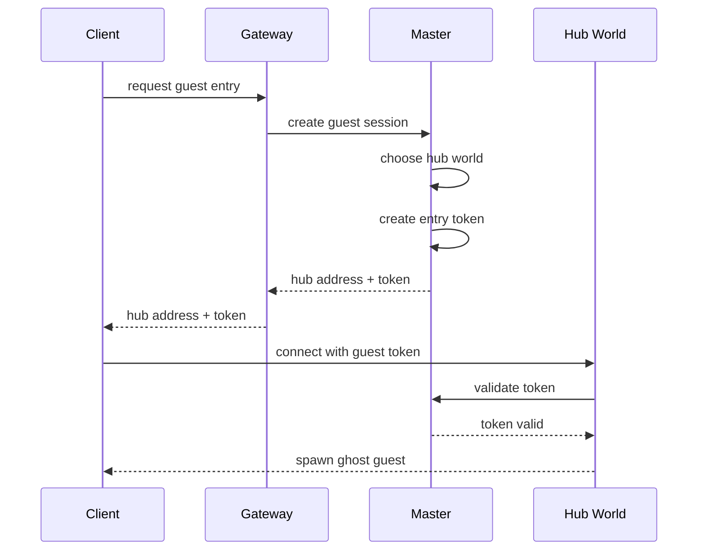
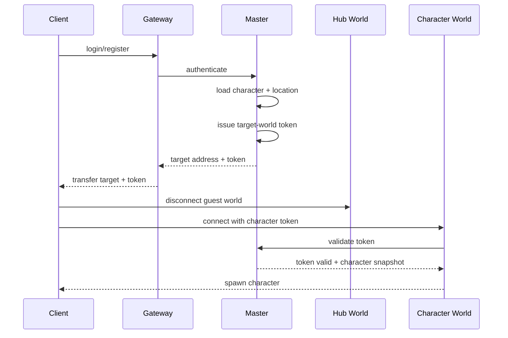
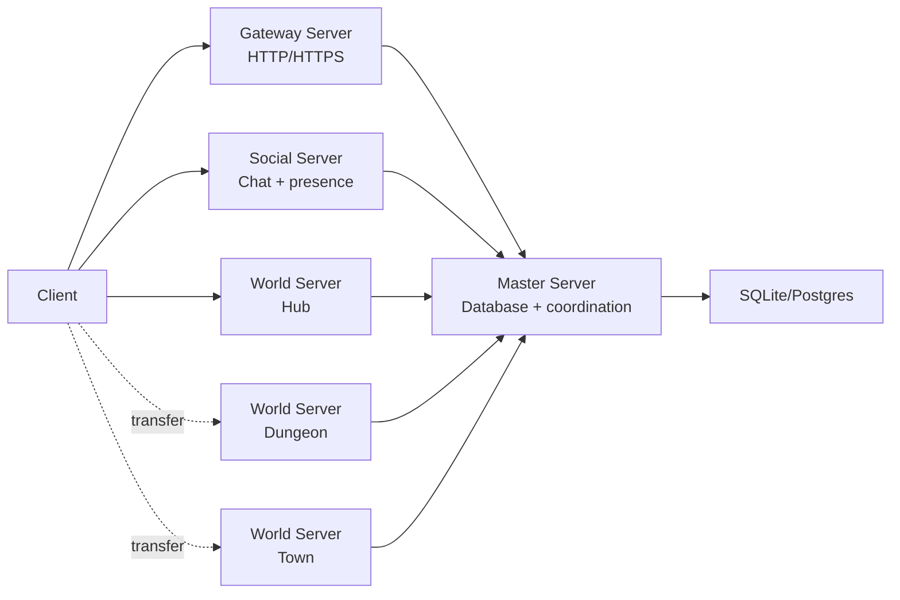

# VirtuCade Infrastructure

This document sketches the intended server infrastructure for **VirtuCade**, a
small-scale 2D online RPG/MMORPG built from the lessons in this Godot
multi-server spike.

The goal is not to design a giant MMO platform. The goal is a simple structure
that can start as an MVP, support real players, and grow toward dozens of world
servers and 100+ concurrent users without forcing a rewrite.

## High-Level Overview

VirtuCade should use four main server roles:

- **Gateway Server**: public entry point for guest sessions, register/login, and
  initial world routing.
- **Master Server**: private coordinator and database owner.
- **World Server**: authoritative gameplay runtime for one scene, map, shard, or
  instance.
- **Social Server**: chat and social presence service.

Recommended topology:

```text
Client -> Gateway Server  HTTP/HTTPS
Client -> World Server    Godot WebSocket multiplayer
Client -> Social Server   WebSocket or Godot WebSocket multiplayer

Gateway Server -> Master Server  internal RPC/HTTP/WebSocket
World Server   -> Master Server  internal RPC/WebSocket
Social Server  -> Master Server  internal RPC/HTTP/WebSocket
Master Server  -> Database       SQLite first, Postgres later if needed
```

The most important design rule:

```text
World servers run gameplay.
Master owns durable truth.
Gateway is the public front door.
Social owns cross-world communication.
```

## Why These Server Names

### Gateway Server

Use **Gateway Server** instead of only `Auth Server` or `Login Server` because
this role does more than authentication.

It handles:

- guest entry
- register/login
- session creation
- hub/world route lookup
- returning world addresses and entry tokens
- public HTTP requests
- basic rate limiting and abuse protection

`Auth Server` is too narrow if guests can enter before login. `Login Server` is
an older MMO term and still understandable, but it hides the routing/API role.
`Gateway Server` is the clearest general name for the public door into the
system.

### Master Server

The **Master Server** is the private control-plane server.

It should not be a gameplay server. It should not simulate maps. It should own
coordination and durable state.

It handles:

- accounts
- guest sessions
- character records
- character location
- world server registry
- world heartbeats
- transfer tokens
- database reads/writes
- save requests
- admin commands

### World Server

The **World Server** is the authoritative runtime for gameplay.

For the MVP, each world server can host exactly one scene/map/instance. That
keeps the mental model simple:

```text
one world server process = one active playable scene
```

Later, a world server can host a small map group or multiple instances if that
becomes useful.

### Social Server

The **Social Server** starts as chat, but the name leaves room for related
cross-world social features.

It can eventually handle:

- global chat
- local/instance chat forwarding
- private messages
- guild chat
- party chat
- friends list
- online presence
- blocks/ignores
- invites
- party membership
- guild membership notifications
- mail/offline messages
- moderation logs
- chat history
- "which world is my friend in?"

Do not build all of this at once. Start with global chat and presence.

## Core Flow: Guest Starts In Hub

VirtuCade's planned flow is:

1. Player starts the client.
2. Client asks the Gateway for guest entry.
3. Gateway asks Master to create or validate a guest session.
4. Master chooses the hub world server.
5. Master issues a temporary world-entry token.
6. Gateway returns hub world address plus token.
7. Client connects to the hub World Server as a guest.
8. Client spawns in the hub as a ghost guest.
9. Client can move around the hub before registering or logging in.
10. Client cannot enter other worlds until the guest session becomes an
   authenticated account/character session.



Guests should be visually distinct from logged-in characters. In the hub world,
they should appear as ghosts: visible enough to prove presence and movement, but
clearly marked as temporary/unregistered players. A guest token should only be
valid for the hub world. If a ghost guest enters a portal or requests travel to
any non-hub world, the world server should reject the transfer and show a login
or register prompt.

## Register/Login From Inside Gameplay

After the guest is already inside the hub, the player can register or login from
an in-game UI.

Recommended flow:

1. Client submits register/login to Gateway over HTTPS.
2. Gateway forwards the request to Master.
3. Master validates credentials or creates an account.
4. Master loads the selected character.
5. Master checks the character's saved world/location.
6. Master issues a world-entry token for the target world.
7. Client transfers from the guest hub to the character's real world.



The hub world should not own account data. It can display the login UI and
request a transfer, but the Gateway and Master should handle identity and
durable state.

## World Transfer Flow

World transfer should be explicit and token-based.

1. Client enters portal or requests travel.
2. Current World Server validates the request locally.
3. Current World Server asks Master for a transfer.
4. Master checks the destination and updates intended character location.
5. Master issues a short-lived token for the target World Server.
6. Client disconnects from current world.
7. Client connects to target world and presents token.
8. Target World Server validates token with Master.
9. Target World Server spawns the character.

```text
Client -> Current World: request travel
Current World -> Master: request transfer
Master -> Current World/Client: target address + token
Client -> Target World: connect with token
Target World -> Master: validate token
Target World -> Client: spawn
```

For the MVP, this can be done with a simple portal and a short-lived token.
Avoid prediction, rollback, cross-server entity handoff, and complex loading
screens until the simple version works.

## Social Server Flow

The Social Server should be independent from world travel.

The client keeps a Social connection while swapping World connections:

```text
Client -> Social Server: persistent
Client -> World Server A: active gameplay
Client swaps to World Server B
Client -> Social Server: still connected
```

The Social Server should ask Master for identity/session validation:

```text
Client -> Social: connect with session token
Social -> Master: validate session
Master -> Social: account id, character id, display name, roles
Social -> Client: connected
```

Early MVP social features:

- global chat
- sender id/display name
- online presence
- join/leave notifications

Later social features:

- private messages
- friends
- blocks
- guild chat
- party chat
- invites
- offline mail/messages
- moderation history

## Data Ownership

The safest ownership model:

| Data | Owner | Notes |
| --- | --- | --- |
| Accounts | Master | Gateway never writes accounts directly. |
| Password hashes | Master | Gateway forwards credentials over trusted internal channel. |
| Guest sessions | Master | Gateway requests them; Master owns them. |
| Character records | Master | Name, stats, saved world, saved position, inventory. |
| World registry | Master | World servers register and heartbeat. |
| Transfer tokens | Master | Short-lived and single-use if practical. |
| Runtime player position | World | Non-persistent moment-to-moment state. |
| Final saved position | Master | Updated on transfer, logout, checkpoint, or periodic save. |
| NPC/runtime entities | World | World owns simulation. |
| Chat messages | Social | Social may persist to Master DB or its own DB. |
| Friends/guilds/blocks | Social or Master | Start on Master; split to Social later if needed. |
| Audit/moderation logs | Master or Social | Depends on what produced the event. |

Simple rule:

```text
If losing it would hurt the player, Master or Social persists it.
If it only exists during active gameplay, World owns it.
```

## Database Recommendation

Start with SQLite if one Master process owns all durable writes.

SQLite is a good early fit because:

- one database file
- no external database server
- transactions
- indexes
- queries
- backup tooling
- WAL mode
- fewer custom save/load bugs than resource files

Use Postgres later if:

- multiple services need direct database access
- admin tools become complex
- you need better concurrent writes
- you need stronger operational tooling
- SQLite write locking becomes painful
- deployment moves to multiple machines

Do not start with resource files for account/character/social data unless the
goal is only a throwaway prototype. Resources are fine for static Godot content,
but accounts, characters, guilds, chat, and moderation logs are relational and
query-heavy.

## Transport Recommendation

Use each transport where it is strongest:

| Connection | Transport | Why |
| --- | --- | --- |
| Client -> Gateway | HTTP/HTTPS | Login, register, guest entry, request/response, rate limiting. |
| Client -> World | Godot WebSocket multiplayer | Realtime Godot gameplay and high-level replication. |
| Client -> Social | WebSocket or Godot WebSocket multiplayer | Persistent realtime chat/presence. |
| Gateway -> Master | Internal HTTP/RPC/WebSocket | Simple trusted server-to-server request flow. |
| World -> Master | Internal WebSocket/RPC | Heartbeats, token validation, transfer requests. |
| Social -> Master | Internal HTTP/RPC/WebSocket | Session validation and identity lookup. |

For this Godot codebase, using `WebSocketMultiplayerPeer` for World and Social
keeps it close to the current spike.

## Scaling Model

VirtuCade does not need a giant MMO cluster to support 100+ CCU.

Recommended scaling model:

```text
1 Gateway Server
1 Master Server
1 Social Server
N World Servers
```

Scale World Servers first:

- one hub world server
- one world server per dungeon instance
- one world server per map/scene
- one world server per busy shard

For dozens of world servers, Master needs:

- world registration
- heartbeat timeout
- player counts
- map/scene ownership
- route lookup
- transfer tokens
- graceful shutdown/drain commands

World servers should simulate only active content. A server with one inactive
scene should do almost nothing.

## MVP Version

The smallest serious VirtuCade MVP:

```text
Gateway Server
- HTTP guest entry
- HTTP login/register
- returns hub/world address + token

Master Server
- SQLite database
- accounts
- characters
- world registry
- token issuing/validation

World Server
- Godot WebSocket multiplayer
- one scene per process
- validates token with Master
- spawns player
- portal transfer

Social Server
- WebSocket chat
- global chat
- presence
```

MVP acceptance test:

1. Start Master.
2. Start Gateway.
3. Start Social.
4. Start Hub World.
5. Start Character World.
6. Client requests guest entry.
7. Client connects to Hub World as guest.
8. Client connects to Social.
9. Client sends chat.
10. Client registers/logs in from hub.
11. Master loads/saves character.
12. Client transfers to character world.
13. Social connection remains alive.
14. Client transfers through a portal to another world.
15. Master records new character location.

## What To Avoid Early

Avoid these until the MVP is stable:

- custom packet protocol
- Kubernetes
- distributed database
- multi-master persistence
- prediction
- rollback
- cross-world combat
- seamless cross-server entity streaming
- complex guild systems
- auction house
- party matchmaking
- microservice sprawl
- world servers writing directly to the account database

## Recommended Development Order

1. Keep the current Godot multi-server spike working.
2. Rename/reshape roles conceptually around Gateway, Master, World, Social.
3. Add Master-owned SQLite.
4. Add world registration and heartbeat metadata.
5. Add guest entry through Gateway.
6. Add token validation for World and Social connections.
7. Add register/login through Gateway.
8. Add character location persistence.
9. Add portal transfer with saved location update.
10. Add Social global chat and presence.
11. Add friends/blocks/private messages only after the core loop is stable.

## Final Target Shape



VirtuCade should feel like one connected world to the player, but internally it
can stay simple:

- Gateway gets players in.
- Master knows the truth.
- World servers run gameplay.
- Social keeps people connected across worlds.
